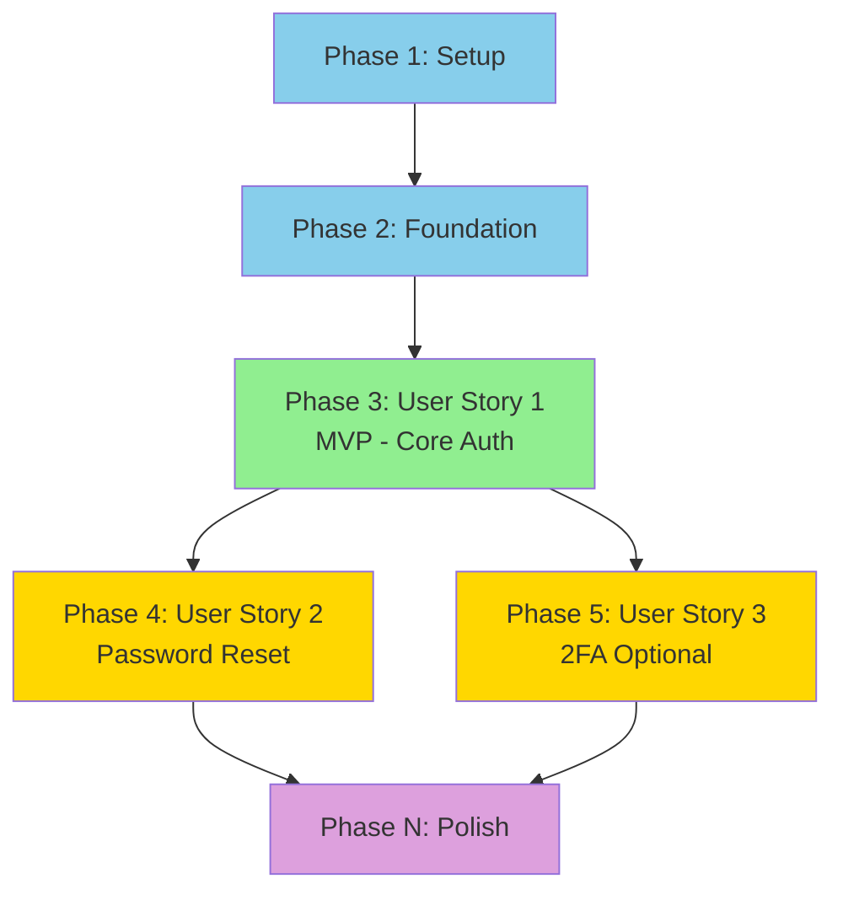

## User Input

```text
$ARGUMENTS
```

You **MUST** consider the user input before proceeding (if not empty).

## Outline

This command breaks down the system design into concrete implementation tasks organized by user story. It uses Cursor's Plan Mode to create a high-quality implementation plan before any code is written.

### Step 0: Prerequisites

Verify that spec and design exist:

```bash
bash .cursor/scripts/check-tasks-prerequisites.sh "$ARGUMENTS"
```

The script will:
- Verify spec file exists
- Verify design file exists
- Check that agents.md exists
- Output paths for all required files

If prerequisites fail, instruct user to complete spec and design first.

### Step 1: Open Plan Mode

**CRITICAL**: This command REQUIRES Plan Mode for best results.

Instruct user:

```
Press Shift+Tab+Tab to enter Plan Mode

This is essential - Plan Mode creates significantly better task breakdowns
than standard chat mode because it can think through the entire plan
before committing to an approach.
```

### Step 2: Load Context into Plan Mode

Once in Plan Mode, load these files:

```markdown
Load into context:
- Spec: docs/specs/[feature-name].md
- Design: docs/specs/[feature-name]-design.md
- Research: docs/specs/[feature-name]-research.md (if exists)
- Standards: .cursor/agents.md
```

### Step 3: Generate Task Plan Outline

Using Plan Mode, create an implementation plan outline:

```markdown
Based on:
- Spec with user stories (P1/P2/P3)
- Design with architecture and database schema
- Project standards from agents.md

Create a task breakdown that:

1. **Organizes by User Story** (CRITICAL)
   - Phase 1: Setup
   - Phase 2: Foundation (blocking prerequisites)
   - Phase 3: User Story 1 (P1 - MVP)
   - Phase 4: User Story 2 (P2)
   - Phase 5: User Story 3 (P3)
   - Phase N: Polish & Cross-Cutting

2. **Makes each story independently testable**
   - What test proves this story works?
   - Can I test without other stories complete?

3. **Identifies parallelizable work**
   - Which tasks touch different files?
   - Which tasks have no dependencies?

4. **Defines MVP scope**
   - Usually just User Story 1
   - What's minimum to validate core value?

Before generating tasks, present the outline for approval.
```

**Ask strategic questions:**

```markdown
Planning Questions:

1. **MVP Scope**: Spec has [N] user stories (P1/P2/P3).
   - Recommend: P1 only for MVP (validate core value first)
   - Alternative: P1 + P2 (if P2 is critical for usability)
   - Your preference?

2. **Testing Approach**: 
   - Option A: Write tests alongside implementation (TDD)
   - Option B: Write tests after implementation (test-after)
   - Option C: Only test critical paths (minimal)
   - Recommendation: [Based on agents.md testing standard]
   - Your preference?

3. **Implementation Order** within each story:
   - Recommend: Database → Business Logic → API → Tests → Integration
   - This order catches data model issues early
   - Alternative order if needed?

4. **Parallel Work**: 
   - Can we work on multiple stories simultaneously?
   - Recommend: Complete P1 fully before starting P2 (avoid partial features)
   - Your preference?
```

### Step 4: Create Task Breakdown

After outline approved, generate detailed task breakdown:

```bash
bash .cursor/scripts/create-tasks.sh "docs/specs/[feature-name].md"
```

This creates `docs/specs/[feature-name]-tasks.md` with template structure.

### Step 5: Populate Tasks with Strict Format

**CRITICAL TASK FORMAT** - Every task MUST follow this pattern:

```
- [ ] [TaskID] [P?] [Story?] Description with file path
```

**Format Rules:**

1. **Checkbox**: Always start with `- [ ]`
2. **Task ID**: Sequential number (T001, T002, T003...)
3. **[P] Marker**: ONLY if task is parallelizable
   - Different files than other running tasks
   - No dependencies on incomplete tasks
   - Example: `[P]`
4. **[Story] Label**: REQUIRED for user story phases
   - Format: [US1], [US2], [US3], etc.
   - Setup phase: NO story label
   - Foundation phase: NO story label
   - User Story phases: MUST have story label
   - Polish phase: NO story label
5. **Description**: Clear action with exact file path

**Examples:**

✅ CORRECT:
```
- [ ] T001 Initialize project structure per implementation plan
- [ ] T005 [P] Implement authentication middleware in src/middleware/auth.js
- [ ] T012 [P] [US1] Create User model in src/models/user.js
- [ ] T014 [US1] Implement UserService in src/services/user-service.js
```

❌ WRONG:
```
- [ ] Create User model  (missing ID and Story label)
T001 [US1] Create model  (missing checkbox)
- [ ] [US1] Create User model  (missing Task ID)
- [ ] T001 [US1] Create model  (missing file path)
```

### Step 6: Organize Tasks by Phase

**Phase Structure:**

#### Phase 1: Setup
```markdown
## Phase 1: Setup

**Goal**: Initialize project structure and dependencies

**Tasks**:
- [ ] T001 Initialize project structure (src/, tests/, config/)
- [ ] T002 Install dependencies from package.json
- [ ] T003 Configure environment variables (.env.example)
- [ ] T004 Setup database connection and pool
- [ ] T005 [P] Create ignore files (.gitignore, .dockerignore)
```

#### Phase 2: Foundation (Blocking Prerequisites)
```markdown
## Phase 2: Foundation

**Goal**: Build shared infrastructure required by all user stories

**What makes this foundation**:
- Shared utilities used by multiple stories
- Database schema (all tables)
- Authentication middleware
- Error handling
- Logging setup

**Tasks**:
- [ ] T006 Run database migrations (all tables)
- [ ] T007 [P] Create base error classes in src/errors/
- [ ] T008 [P] Setup logging with Winston in src/utils/logger.js
- [ ] T009 Create database query helpers in src/db/
- [ ] T010 [P] Setup test framework (Jest/Mocha)
```

#### Phase 3+: User Stories (One Phase Per Story)
```markdown
## Phase 3: User Story 1 (P1 - MVP) - [Story Name from Spec]

**Story Goal**: [Exact goal from spec]

**Acceptance Criteria** (from spec):
- [ ] [Criterion 1]
- [ ] [Criterion 2]

**Independent Test**: 
How to verify this story works without other stories:
- [Specific test scenario]
- Expected outcome: [What user sees/system does]

**Tasks**:
- [ ] T011 [P] [US1] Create User model in src/models/user.js
- [ ] T012 [P] [US1] Create Session model in src/models/session.js
- [ ] T013 [US1] Implement UserService in src/services/user-service.js
  - Password hashing (bcrypt)
  - Email validation
  - User creation
- [ ] T014 [US1] Implement AuthService in src/services/auth-service.js
  - Login logic
  - Session creation
  - Token generation
- [ ] T015 [US1] Create POST /auth/register endpoint in src/routes/auth.js
- [ ] T016 [US1] Create POST /auth/login endpoint in src/routes/auth.js
- [ ] T017 [US1] Add authentication middleware in src/middleware/auth.js
- [ ] T018 [P] [US1] Write unit tests for UserService
- [ ] T019 [P] [US1] Write unit tests for AuthService
- [ ] T020 [US1] Write integration tests for auth endpoints
- [ ] T021 [US1] Verify story completion (manual test scenario)
```

**Important**: Each story phase follows same structure:
- Story goal from spec
- Acceptance criteria from spec
- Independent test scenario
- Tasks (Data models → Services → API → Tests → Verification)

#### Final Phase: Polish & Cross-Cutting
```markdown
## Phase N: Polish & Cross-Cutting Concerns

**Goal**: Production readiness and final improvements

**Tasks**:
- [ ] T0XX [P] Add input validation to all endpoints
- [ ] T0XX [P] Add rate limiting middleware
- [ ] T0XX [P] Setup monitoring (metrics, logging)
- [ ] T0XX [P] Write API documentation (OpenAPI/Swagger)
- [ ] T0XX [P] Add security headers (helmet.js)
- [ ] T0XX Performance optimization based on profiling
- [ ] T0XX Final integration test (all stories together)
```

### Step 7: Create Dependency Graph

Generate visual dependency graph:

```markdown
## Dependencies & Execution Flow

### Story Completion Order



### Parallel Execution Opportunities

**Within User Story 1**:
- T011, T012 (models) can run in parallel
- T018, T019 (unit tests) can run in parallel

**Across Stories** (if multi-developer team):
- After US1 complete: US2 and US3 can start in parallel
- Polish tasks mostly parallelizable

**Single Developer Recommendation**:
- Complete US1 fully before starting US2
- Avoid context switching between stories
```

### Step 8: Define MVP Scope

```markdown
## MVP Definition

**Minimum Viable Product** = Phase 1 + Phase 2 + Phase 3 (User Story 1)

**What you get**:
- [Specific user capability from US1]
- [Another capability from US1]

**What you defer**:
- Phase 4 (User Story 2): [Feature name]
- Phase 5 (User Story 3): [Feature name]

**Why this MVP**:
- Validates core value proposition
- Can be tested by real users
- Provides foundation for additional stories
- ~[X] days of development

**Success Metrics** (from spec success criteria):
- [Measurable outcome 1]
- [Measurable outcome 2]
```

### Step 9: Validate Task Breakdown

Run validation script:

```bash
bash .cursor/scripts/validate-tasks.sh "docs/specs/[feature-name]-tasks.md"
```

**Validation checks:**
- [ ] All tasks follow format: `- [ ] [TaskID] [P?] [Story?] Description`
- [ ] Task IDs are sequential (T001, T002, T003...)
- [ ] Every user story phase has [US1], [US2] labels on tasks
- [ ] Setup and Foundation phases have NO story labels
- [ ] Each story has independent test defined
- [ ] File paths included in task descriptions
- [ ] Dependencies are logical (no circular dependencies)
- [ ] MVP scope clearly defined

If validation fails, fix issues and re-validate.

### Step 10: Validate Against agents.md

Check task breakdown against project standards:

```markdown
## Validation Against agents.md

**Code Standards Alignment**:
- [ ] Testing tasks included (per testing standard)
- [ ] Security tasks included (per security standard)
- [ ] Error handling approach follows standard
- [ ] Code formatting approach specified

**Architecture Principles Alignment**:
- [ ] Tasks implement all MUST principles
- [ ] Tasks consider all SHOULD principles
- [ ] Deviations have documented rationale

**Completeness**:
- [ ] Every requirement from spec has tasks
- [ ] Every component from design has tasks
- [ ] All database tables have creation tasks
- [ ] All API endpoints have implementation tasks

**Feasibility**:
- [ ] Task granularity appropriate (~30-60 min each)
- [ ] No tasks require unspecified technology
- [ ] Dependencies can be completed in order
```

### Step 11: Report Completion

Display summary:

```markdown
✅ Implementation plan created!

📝 File: docs/specs/[feature-name]-tasks.md

📊 Task Summary:
- Total Tasks: [count]
- Setup: [count]
- Foundation: [count]
- User Story 1 (MVP): [count]
- User Story 2: [count]
- User Story 3: [count]
- Polish: [count]

🎯 MVP Scope:
- Phases: Setup + Foundation + User Story 1
- Tasks: [count] tasks
- Estimated: ~[X] days

📈 Parallel Opportunities:
- [N] tasks marked [P] for parallel execution
- Within stories: [specific tasks]
- Across stories: [if applicable]

✅ Validation:
- Task format: ✓
- User story organization: ✓
- Dependencies logical: ✓
- MVP clearly defined: ✓
- Aligned with agents.md: ✓

🎯 Next Steps:
1. Review task breakdown for accuracy
2. Start implementation with /implement-story "User Story 1"
3. Complete MVP before adding P2/P3 features

💡 Implementation Tips:
- Work story-by-story (don't jump between stories)
- Each story should work independently
- Test each story fully before moving to next
- Update agents.md with learnings as you go
```

## Guidelines

### Task Organization Principles

**1. User Story Organization (CRITICAL)**

Why organize by user story instead of sequential tasks?

- **Independent Testing**: Each story can be tested without others
- **Incremental Value**: Each story delivers user value
- **Parallel Work**: Different developers can work on different stories
- **Clear Progress**: "US1 complete" is meaningful milestone
- **Easier Review**: Review story-by-story, not scattered tasks

**Bad (Sequential)**:
```
- Create all models (T001-T010)
- Create all services (T011-T020)
- Create all endpoints (T021-T030)
- Create all tests (T031-T040)
```
Problem: Can't test anything until everything done.

**Good (By User Story)**:
```
US1: Create User model → Service → Endpoint → Test (working feature)
US2: Create Password Reset model → Service → Endpoint → Test (working feature)
```
Benefit: US1 is fully testable before US2 starts.

**2. MVP First**

- Always complete P1 (User Story 1) fully first
- This validates core value proposition
- Proves technical approach works
- Provides foundation for other stories
- Typically 30-50% of total work

**3. Independent Testing**

Each user story phase MUST define how to test it independently:

```markdown
**Independent Test for US1**: 
1. Start server
2. POST /auth/register with valid email/password
3. Verify: Receive session token
4. POST /auth/login with same credentials
5. Verify: Receive session token
6. GET /auth/me with token
7. Verify: Receive user profile

Success = All steps work without US2 or US3 implemented
```

**4. Parallel Task Marking**

Mark tasks [P] ONLY if they:
- Modify different files
- Have no dependencies on incomplete tasks
- Can be safely worked on simultaneously

Example:
```
- [ ] T011 [P] [US1] Create User model in src/models/user.js
- [ ] T012 [P] [US1] Create Session model in src/models/session.js
```
These are parallel because different files, no dependencies.

```
- [ ] T013 [US1] Create UserService (depends on User model)
- [ ] T014 [US1] Create AuthService (depends on UserService)
```
These are NOT parallel - must be sequential.

### Task Granularity

**Good Task Size**: 30-60 minutes of focused work

**Too Small**:
```
- [ ] T001 Import bcrypt
- [ ] T002 Write hash function
- [ ] T003 Write verify function
```
Combine: "Implement password hashing with bcrypt"

**Too Large**:
```
- [ ] T001 Implement entire authentication system
```
Break down: Registration → Login → Session → Verification

**Just Right**:
```
- [ ] T013 [US1] Implement UserService in src/services/user-service.js
  - Password hashing (bcrypt)
  - Email validation
  - User creation with error handling
```

### Testing Task Rules

**If testing standard in agents.md requires tests:**
- Include test tasks for each component
- Place test tasks after implementation tasks in same story
- Mark test tasks [P] if they test different components

**If TDD approach:**
- Test task BEFORE implementation task
- Example: T018 Write UserService tests → T019 Implement UserService

**If test-after approach:**
- Implementation task first
- Test task after: T018 Implement UserService → T019 Test UserService

**Minimal testing:**
- Only integration tests for critical paths
- Unit tests only for complex business logic

### Common Mistakes to Avoid

❌ **Not organizing by user story**
- Tasks scattered by type instead of feature
- Can't test partially complete work

❌ **Missing file paths**
- "Create User model" → Where?
- Should be: "Create User model in src/models/user.js"

❌ **Incorrect story labels**
- Setup tasks with [US1] label
- Missing [US1] label on story-specific tasks

❌ **No independent test defined**
- Can't verify story works without other stories

❌ **Wrong parallel markers**
- Marking dependent tasks as [P]
- Not marking clearly parallel tasks

❌ **Vague descriptions**
- "Handle errors" → Which errors? How?
- "Add validation" → Which fields? What rules?

❌ **Missing MVP definition**
- No clear line between must-have and nice-to-have

## Context

Feature specification and design paths: $ARGUMENTS
