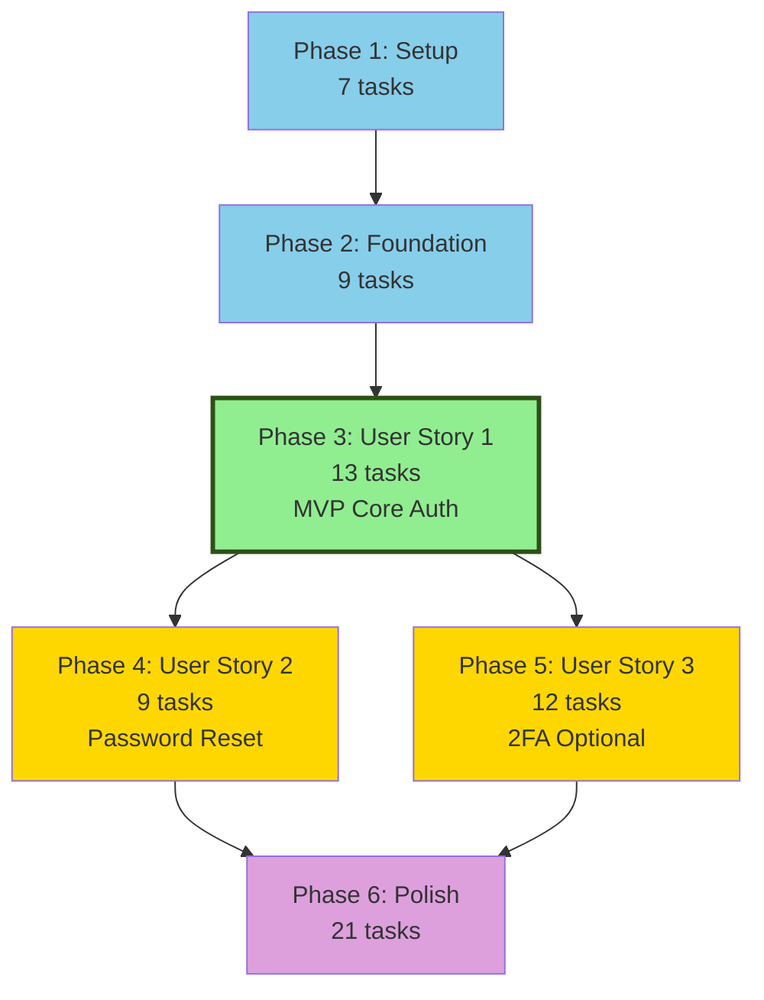

# TASKS TEMPLATE - Example: User Authentication Implementation

This is a reference template showing what a high-quality task breakdown looks like. Use this as a guide when creating your own task plans.

---

# Implementation Tasks: User Authentication with Email/Password

**Created**: 2026-01-11  
**Status**: In Progress  
**Related Spec**: user-authentication.md  
**Related Design**: user-authentication-design.md

---

## Task Format

**Every task MUST follow this format:**

```
- [ ] [TaskID] [P?] [Story?] Description with file path
```

✅ **Good Examples:**
- `- [ ] T001 Initialize project structure per plan`
- `- [ ] T012 [P] [US1] Create User model in src/models/user.js`
- `- [ ] T014 [US1] Implement UserService with bcrypt in src/services/user-service.js`

❌ **Bad Examples:**
- `Create User model` (missing checkbox, ID, story label, file path)
- `T001 [US1] Create model` (missing checkbox, file path)
- `- [ ] [US1] Create User model` (missing TaskID, file path)

---

## MVP Definition

**Minimum Viable Product** = Phase 1 + Phase 2 + Phase 3 (User Story 1)

**What MVP Delivers**:
- User registration with email/password
- User login with session management
- Basic profile access for authenticated users
- Password security with bcrypt hashing

**What MVP Defers**:
- Phase 4 (User Story 2): Password reset via email
- Phase 5 (User Story 3): Two-factor authentication (2FA)
- Email verification (send email but don't require it)
- Session management UI (users can't see/revoke sessions)

**Why This Scope**:
- Validates core auth flow works
- Can be tested by real users
- Provides foundation for password reset and 2FA
- Estimated: ~3-4 days of development

**Success Metrics** (from spec):
- Users complete registration in < 2 minutes
- 95% of login attempts succeed on first try (valid credentials)
- Zero unauthorized account access

---

## Phase 1: Setup

**Goal**: Initialize project structure and dependencies

**Tasks**:
- [ ] T001 Initialize Node.js project structure (src/, tests/, config/)
- [ ] T002 Install dependencies: express, bcrypt, pg, dotenv, winston, jest
- [ ] T003 Configure environment variables in .env.example (DB_URL, JWT_SECRET, PORT)
- [ ] T004 Setup PostgreSQL connection pool in src/db/connection.js (max 20 connections)
- [ ] T005 [P] Create .gitignore (node_modules, .env, logs/, coverage/)
- [ ] T006 [P] Setup ESLint and Prettier per agents.md standards
- [ ] T007 [P] Create basic Express app structure in src/app.js

**Completion Criteria**: 
- Project structure exists
- `npm install` succeeds
- Database connects successfully (test with simple query)
- Environment variables documented

---

## Phase 2: Foundation (Blocking Prerequisites)

**Goal**: Build shared infrastructure required by all user stories

**What Makes This Foundation**:
- Database schema (all tables created upfront)
- Error handling framework
- Logging setup
- Request validation middleware
- Response formatting
- Testing framework

**Tasks**:
- [ ] T008 Create database migration 001_initial_schema.sql (users, sessions, password_resets tables)
- [ ] T009 Run migration to create all tables (verify with \dt in psql)
- [ ] T010 [P] Create base error classes in src/errors/ (ValidationError, AuthError, DatabaseError)
- [ ] T011 [P] Setup Winston logging in src/utils/logger.js (error/warn/info levels)
- [ ] T012 [P] Create request validation middleware in src/middleware/validate.js (uses Joi)
- [ ] T013 [P] Create API response formatter in src/utils/response.js (success/error formats)
- [ ] T014 [P] Setup Jest test framework in tests/ (unit/, integration/ folders)
- [ ] T015 Create global error handler middleware in src/middleware/error-handler.js
- [ ] T016 [P] Create database query helpers in src/db/queries.js (parameterized queries)

**Completion Criteria**:
- All 4 database tables exist (users, sessions, password_resets, audit_log)
- Base utilities work (logger logs, errors throw correctly)
- Jest runs (even with 0 tests)
- Middleware integrated in Express app

---

## Phase 3: User Story 1 (P1 - MVP) - User Registration and Login

**Story Goal**: Users can create accounts and log in to access the system

**Acceptance Criteria** (from spec):
- [ ] User can register with email address and password
- [ ] Email format is validated before account creation
- [ ] Password must meet security requirements (8+ chars, letter + number)
- [ ] User receives session token after registration (no email verification required)
- [ ] User can log in with email/password and receive session token
- [ ] Failed login shows clear error without exposing whether email exists
- [ ] After 5 failed attempts, account locks for 15 minutes

**Independent Test Scenario**:

```bash
# 1. Start server
npm start

# 2. Register new user
curl -X POST http://localhost:3000/api/auth/register \
  -H "Content-Type: application/json" \
  -d '{"email":"sarah@example.com","password":"SecurePass123"}'
# Expected: 201 Created with user object and session token

# 3. Verify user in database
psql -d auth_db -c "SELECT email, email_verified, status FROM users WHERE email='sarah@example.com';"
# Expected: sarah@example.com | false | active

# 4. Login with same credentials
curl -X POST http://localhost:3000/api/auth/login \
  -H "Content-Type: application/json" \
  -d '{"email":"sarah@example.com","password":"SecurePass123"}'
# Expected: 200 OK with session token

# 5. Access protected resource
curl -X GET http://localhost:3000/api/auth/me \
  -H "Authorization: Bearer <session_token>"
# Expected: 200 OK with user profile

# 6. Test account lockout
# Make 5 failed login attempts
for i in {1..5}; do
  curl -X POST http://localhost:3000/api/auth/login \
    -H "Content-Type: application/json" \
    -d '{"email":"sarah@example.com","password":"WrongPass123"}'
done
# Expected: 6th attempt returns 423 Locked

Success = All steps complete without errors
```

**Tasks**:

### Data Models (can be parallel)
- [ ] T017 [P] [US1] Create User model in src/models/user.js
  - Fields: id, email, password_hash, email_verified, status, failed_login_count, locked_until
  - Methods: create(), findByEmail(), updateFailedLoginCount(), lockAccount()
- [ ] T018 [P] [US1] Create Session model in src/models/session.js
  - Fields: id, user_id, token, created_at, expires_at, last_activity_at
  - Methods: create(), findByToken(), updateActivity(), delete()

### Business Logic
- [ ] T019 [US1] Implement UserService in src/services/user-service.js
  - hashPassword(password) using bcrypt cost 10
  - validateEmail(email) using regex
  - createUser(email, password) - hash password, insert user
  - Error handling for duplicate email
- [ ] T020 [US1] Implement AuthService in src/services/auth-service.js
  - login(email, password) - verify credentials, track failures, create session
  - handleFailedLogin(userId) - increment count, lock if needed
  - generateSessionToken() - 64 random bytes as hex
  - checkAccountLock(user) - verify not locked or lock expired
  - Depends on: T019 (UserService must exist)

### API Layer
- [ ] T021 [US1] Create POST /api/auth/register endpoint in src/routes/auth.js
  - Validate email format, password requirements
  - Call UserService.createUser()
  - Create session on success
  - Return 201 with user + session token
  - Error handling: 400 validation, 409 duplicate email
- [ ] T022 [US1] Create POST /api/auth/login endpoint in src/routes/auth.js
  - Validate request body
  - Call AuthService.login()
  - Track failed attempts
  - Return 200 with session token
  - Error handling: 401 invalid, 423 locked
  - Depends on: T020 (AuthService must exist)
- [ ] T023 [US1] Create GET /api/auth/me endpoint in src/routes/auth.js
  - Requires authentication middleware
  - Return current user profile
  - Error handling: 401 if invalid token
- [ ] T024 [US1] Create authentication middleware in src/middleware/auth.js
  - Extract token from Authorization header
  - Validate session (check expiration, update activity)
  - Attach user to request object
  - Error handling: 401 if invalid/expired

### Testing
- [ ] T025 [P] [US1] Write unit tests for UserService in tests/unit/user-service.test.js
  - Test hashPassword creates valid bcrypt hash
  - Test validateEmail accepts valid, rejects invalid
  - Test createUser inserts correctly
  - Test createUser rejects weak passwords
  - Test createUser rejects duplicate emails
- [ ] T026 [P] [US1] Write unit tests for AuthService in tests/unit/auth-service.test.js
  - Test login succeeds with valid credentials
  - Test login fails with invalid password
  - Test failed login count increments
  - Test account locks after 5 failures
  - Test locked account rejects login
  - Test lock expires after 15 minutes
- [ ] T027 [P] [US1] Write integration tests for auth endpoints in tests/integration/auth.test.js
  - Test POST /auth/register happy path
  - Test POST /auth/register with invalid email
  - Test POST /auth/register with weak password
  - Test POST /auth/register with duplicate email
  - Test POST /auth/login happy path
  - Test POST /auth/login with invalid credentials
  - Test POST /auth/login account lockout
  - Test GET /auth/me with valid token
  - Test GET /auth/me with invalid token

### Story Verification
- [ ] T028 [US1] Perform independent test scenario (curl commands above)
- [ ] T029 [US1] Update API documentation with new endpoints (OpenAPI spec)

**Completion Criteria**:
- All tasks T017-T029 marked [X]
- Independent test scenario passes
- All 7 acceptance criteria met
- Code reviewed
- All 21 test cases passing
- No linting errors

---

## Phase 4: User Story 2 (P2) - Password Reset via Email

**Story Goal**: Users can reset forgotten passwords via email link

**Acceptance Criteria** (from spec):
- [ ] User can request password reset via email
- [ ] Reset link expires after 1 hour
- [ ] User can set new password meeting security requirements
- [ ] Old password is invalidated after reset
- [ ] User is notified via email when password changes

**Independent Test Scenario**:

```bash
# Assumes US1 complete and user exists

# 1. Request password reset
curl -X POST http://localhost:3000/api/auth/forgot-password \
  -H "Content-Type: application/json" \
  -d '{"email":"sarah@example.com"}'
# Expected: 200 OK (email sent)

# 2. Check email (in test: check database for token)
psql -d auth_db -c "SELECT token, expires_at FROM password_resets WHERE user_id=(SELECT id FROM users WHERE email='sarah@example.com') ORDER BY created_at DESC LIMIT 1;"
# Expected: token exists, expires_at is ~1 hour from now

# 3. Reset password with token
curl -X POST http://localhost:3000/api/auth/reset-password \
  -H "Content-Type: application/json" \
  -d '{"token":"<token_from_step2>","password":"NewSecurePass456"}'
# Expected: 200 OK

# 4. Verify old password no longer works
curl -X POST http://localhost:3000/api/auth/login \
  -d '{"email":"sarah@example.com","password":"SecurePass123"}'
# Expected: 401 Unauthorized

# 5. Verify new password works
curl -X POST http://localhost:3000/api/auth/login \
  -d '{"email":"sarah@example.com","password":"NewSecurePass456"}'
# Expected: 200 OK with session token

Success = All steps work correctly
```

**Dependencies**: User Story 1 must be complete (need users and auth working)

**Tasks**:

### Data Model
- [ ] T030 [US2] Create PasswordReset model in src/models/password-reset.js
  - Fields: id, user_id, token, created_at, expires_at, used_at
  - Methods: create(), findByToken(), markUsed(), cleanupExpired()

### Services
- [ ] T031 [US2] Implement PasswordResetService in src/services/password-reset-service.js
  - generateResetToken() - 64 random bytes
  - createResetRequest(userId) - create token, send email
  - validateResetToken(token) - check exists, not used, not expired
  - resetPassword(token, newPassword) - validate, update user, mark token used
- [ ] T032 [US2] Integrate SendGrid email service in src/services/email-service.js
  - sendPasswordResetEmail(email, resetLink)
  - Use template with company branding
  - Handle SendGrid API errors gracefully

### API Layer
- [ ] T033 [US2] Create POST /api/auth/forgot-password endpoint in src/routes/auth.js
  - Validate email format
  - Call PasswordResetService.createResetRequest()
  - Always return 200 (don't reveal if email exists)
  - Rate limit: 3 requests per email per hour
- [ ] T034 [US2] Create POST /api/auth/reset-password endpoint in src/routes/auth.js
  - Validate token and new password
  - Call PasswordResetService.resetPassword()
  - Return 200 on success
  - Error handling: 400 expired/invalid, 400 weak password

### Testing
- [ ] T035 [P] [US2] Write unit tests for PasswordResetService
  - Test token generation (64 chars, unique)
  - Test token validation (valid, expired, used, not found)
  - Test password reset updates user correctly
  - Test old password invalidated
- [ ] T036 [P] [US2] Write integration tests for password reset flow
  - Test forgot password endpoint
  - Test reset password with valid token
  - Test reset password with expired token
  - Test reset password with used token
  - Test old password no longer works
  - Test new password works
  - Test rate limiting

### Story Verification
- [ ] T037 [US2] Perform independent test scenario
- [ ] T038 [US2] Update API documentation

**Completion Criteria**:
- All tasks T030-T038 marked [X]
- Independent test passes
- All acceptance criteria met
- Email delivery tested (at least in staging)

---

## Phase 5: User Story 3 (P3) - Optional Two-Factor Authentication

**Story Goal**: Users can optionally enable 2FA for enhanced security

**Acceptance Criteria** (from spec):
- [ ] User can enable 2FA in account settings
- [ ] 2FA uses time-based codes (TOTP)
- [ ] User can see backup codes during setup
- [ ] Login requires code after password when 2FA enabled
- [ ] User can disable 2FA with password verification

**Independent Test Scenario**:

```bash
# Assumes US1 complete, user logged in

# 1. Enable 2FA
curl -X POST http://localhost:3000/api/auth/2fa/enable \
  -H "Authorization: Bearer <token>"
# Expected: 200 OK with QR code data and backup codes

# 2. Verify 2FA with code from authenticator app
curl -X POST http://localhost:3000/api/auth/2fa/verify \
  -H "Authorization: Bearer <token>" \
  -d '{"code":"123456"}'
# Expected: 200 OK (2FA now active)

# 3. Logout
curl -X POST http://localhost:3000/api/auth/logout \
  -H "Authorization: Bearer <token>"

# 4. Login requires 2FA code
curl -X POST http://localhost:3000/api/auth/login \
  -d '{"email":"sarah@example.com","password":"SecurePass123"}'
# Expected: 200 OK but session marked as "2fa_pending"

# 5. Submit 2FA code
curl -X POST http://localhost:3000/api/auth/2fa/validate \
  -d '{"email":"sarah@example.com","code":"654321"}'
# Expected: 200 OK with full session token

# 6. Access protected resource now works
curl -X GET http://localhost:3000/api/auth/me \
  -H "Authorization: Bearer <full_token>"
# Expected: 200 OK

Success = 2FA flow works end-to-end
```

**Dependencies**: User Story 1 must be complete

**Tasks**:

### Database Updates
- [ ] T039 [US3] Add 2FA fields to users table migration
  - two_factor_enabled: boolean
  - two_factor_secret: encrypted string
  - backup_codes: encrypted json array
  - Run migration: ALTER TABLE users ADD COLUMN...

### Models
- [ ] T040 [US3] Update User model with 2FA methods in src/models/user.js
  - enable2FA(secret, backupCodes)
  - disable2FA()
  - verify2FACode(code)
  - useBackupCode(code)

### Services
- [ ] T041 [US3] Implement TwoFactorService in src/services/two-factor-service.js
  - generateSecret() - using speakeasy library
  - generateQRCode(secret, email) - for authenticator apps
  - generateBackupCodes(count=10) - random 8-digit codes
  - verifyTOTP(secret, code) - time-based validation
  - Depends on: T040

### API Layer
- [ ] T042 [US3] Create POST /api/auth/2fa/enable endpoint in src/routes/auth.js
  - Requires authentication
  - Generate secret and backup codes
  - Return QR code data and backup codes
  - Don't activate until verified
- [ ] T043 [US3] Create POST /api/auth/2fa/verify endpoint in src/routes/auth.js
  - Verify code matches secret
  - Activate 2FA on user account
  - Return success
- [ ] T044 [US3] Update POST /api/auth/login to check 2FA status in src/routes/auth.js
  - If 2FA enabled, return partial session
  - Require 2FA validation before full access
- [ ] T045 [US3] Create POST /api/auth/2fa/validate endpoint in src/routes/auth.js
  - Validate 2FA code or backup code
  - Upgrade to full session
  - Consume backup code if used
- [ ] T046 [US3] Create POST /api/auth/2fa/disable endpoint in src/routes/auth.js
  - Requires password verification
  - Remove 2FA from account

### Testing
- [ ] T047 [P] [US3] Write unit tests for TwoFactorService
  - Test TOTP generation and validation
  - Test backup code generation (unique, 10 codes)
  - Test backup code consumption (can't reuse)
  - Test time window validation
- [ ] T048 [P] [US3] Write integration tests for 2FA flow
  - Test enable 2FA flow
  - Test login with 2FA
  - Test 2FA code validation
  - Test backup code usage
  - Test disable 2FA
  - Test partial session restrictions

### Story Verification
- [ ] T049 [US3] Perform independent test scenario
- [ ] T050 [US3] Update API documentation

**Completion Criteria**:
- All tasks T039-T050 marked [X]
- Independent test passes
- 2FA works with Google Authenticator / Authy
- Backup codes work as fallback

---

## Phase 6: Polish & Cross-Cutting Concerns

**Goal**: Production readiness and final improvements

**Tasks**:

### Security Hardening
- [ ] T051 [P] Add comprehensive input validation to all endpoints (email, password, token formats)
- [ ] T052 [P] Implement rate limiting per design (5/min login, 3/hour registration)
- [ ] T053 [P] Add security headers using helmet.js (CSP, HSTS, X-Frame-Options)
- [ ] T054 [P] Add request ID tracking for all requests (UUID per request)
- [ ] T055 [P] Sanitize error messages (never expose internal details to users)

### Observability
- [ ] T056 [P] Add structured logging to all services (request_id, user_id, duration)
- [ ] T057 [P] Setup metrics collection (login rate, error rate, latency)
- [ ] T058 [P] Create health check endpoint (database, redis, email service status)
- [ ] T059 [P] Add performance monitoring (slow query alerts)

### Documentation
- [ ] T060 [P] Complete OpenAPI/Swagger documentation for all endpoints
- [ ] T061 [P] Write deployment guide (environment setup, migrations, secrets)
- [ ] T062 [P] Document error codes and meanings for API consumers
- [ ] T063 [P] Create runbook for common operations (user lockouts, password resets)

### Testing & Quality
- [ ] T064 Performance testing (100 concurrent logins, measure latency)
- [ ] T065 Security audit of all endpoints (OWASP checklist)
- [ ] T066 Load testing (1000 users, find breaking point)
- [ ] T067 Final end-to-end test (register → login → use app → reset password → 2FA)

### Deployment Preparation
- [ ] T068 [P] Create Docker configuration (Dockerfile, docker-compose.yml)
- [ ] T069 [P] Setup CI/CD pipeline (test on PR, deploy on merge)
- [ ] T070 [P] Configure production environment variables
- [ ] T071 Database backup and restore procedures

**Completion Criteria**:
- All security measures in place
- Documentation complete
- Performance acceptable (meets spec targets)
- Ready for production deployment

---

## Dependencies & Execution Flow

### Story Completion Order



### Within-Story Dependencies

**User Story 1 (P1 - MVP)**:
```
T017, T018 (Models - Parallel) 
  ↓
T019 (UserService - depends on T017)
  ↓
T020 (AuthService - depends on T019)
  ↓
T021, T022, T023 (API endpoints - depend on T020)
  ↓
T024 (Auth middleware - depends on T018)
  ↓
T025, T026, T027 (Tests - Parallel, depend on implementation)
  ↓
T028, T029 (Verification - sequential)
```

**User Story 2 (P2)**:
```
T030 (PasswordReset model)
  ↓
T031 (PasswordResetService)
  ↓
T032 (EmailService - parallel with T031)
  ↓
T033, T034 (API endpoints)
  ↓
T035, T036 (Tests - parallel)
  ↓
T037, T038 (Verification)
```

### Parallel Execution Opportunities

**Within User Story 1** (single developer):
- T017 ∥ T018 (different models, different files)
- T025 ∥ T026 ∥ T027 (different test files)

**Within Foundation** (single developer):
- T010 ∥ T011 ∥ T012 ∥ T013 ∥ T014 ∥ T016 (different files, independent)

**Across Stories** (multi-developer team):
- After US1 complete:
  - Dev 1: US2 (T030-T038)
  - Dev 2: US3 (T039-T050)
  - Dev 3: Polish security tasks (T051-T055)

**Polish Phase** (multi-developer team):
- Most polish tasks (T051-T063) can run in parallel
- Test tasks (T064-T067) should be sequential

**Recommendation for Solo Development**:
- Complete US1 fully before starting US2
- Avoid context switching between stories
- Each story should work independently before moving to next
- Expected timeline: US1 (2 days) → US2 (1 day) → US3 (1.5 days) → Polish (1 day) = 5.5 days total

---

## Task Summary

**Total Tasks**: 71
- Phase 1 (Setup): 7 tasks
- Phase 2 (Foundation): 9 tasks
- Phase 3 (US1 - MVP): 13 tasks
- Phase 4 (US2): 9 tasks
- Phase 5 (US3): 12 tasks
- Phase 6 (Polish): 21 tasks

**Parallel Tasks**: 26 tasks marked [P] (~37% parallelizable)

**Estimated Effort**:
- MVP (P1 + P2 + P3): ~3-4 days
  - Setup: 0.5 day
  - Foundation: 0.5 day
  - US1: 2-3 days
- P2 (Phase 4): ~1 day
- P3 (Phase 5): ~1.5 days
- Polish: ~1 day
- **Total**: ~6-8 days (single developer, full-time)

---

## Implementation Strategy

### Recommended Approach for Solo Developer

**Week 1: MVP**
- Day 1: Setup + Foundation (T001-T016)
- Days 2-3: User Story 1 (T017-T029)
- Deploy MVP, gather feedback

**Week 2: Additional Features** (if MVP validates)
- Day 4: User Story 2 Password Reset (T030-T038)
- Days 5-6: User Story 3 Two-Factor Auth (T039-T050) OR skip if users don't need

**Week 3: Production Ready**
- Day 7: Polish & hardening (T051-T071)
- Deploy to production

### Alternative: Parallel Development (3 developers)

**Sprint 1 (1 week): MVP**
- All devs: Setup + Foundation (T001-T016) - 1 day
- Dev 1 (lead): Models + services (T017-T020) - 2 days
- Dev 2: API endpoints (T021-T024) - 2 days (starts after T020)
- Dev 3: Tests (T025-T027) - 2 days (starts after T024)
- All devs: Story verification - 0.5 day
- **Result**: Working MVP in 1 week

**Sprint 2 (1 week): P2 + P3**
- Dev 1: US2 Password Reset (T030-T038) - 3 days
- Dev 2: US3 Two-Factor (T039-T050) - 4 days
- Dev 3: Polish security (T051-T055) - 2 days, then docs (T060-T063)
- **Result**: Full feature set in 2 weeks total

**Sprint 3 (3 days): Production Ready**
- Dev 1: Testing (T064-T067)
- Dev 2: Deployment (T068-T071)
- Dev 3: Monitoring (T056-T059)
- **Result**: Production-ready in 2.5 weeks total

---

**Last Updated**: 2026-01-11

**Status**: [X] Draft [ ] In Progress [ ] Complete

**Progress**: 0/71 tasks complete (0%)
