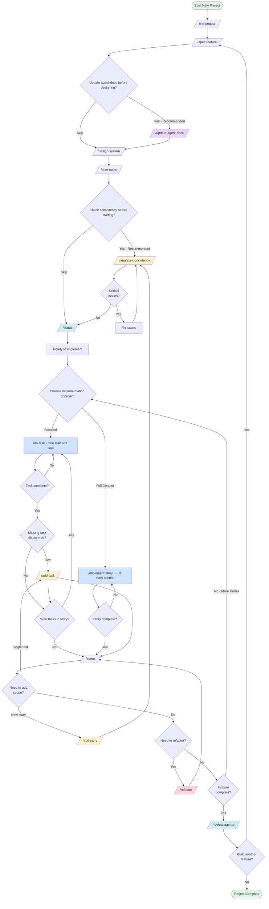

# Cursor AI-Assisted Development Workflow

> A comprehensive, production-grade workflow for building SaaS applications with AI assistance using Cursor IDE.

**Turn AI coding from chaotic prompting into systematic, high-quality development.**

[]()
[]()
[]()
[]()

---

## 🎯 What This Is

A complete workflow system for Cursor IDE that transforms AI-assisted development from ad-hoc prompting into a structured, repeatable process. Includes:

- **12 custom Cursor commands** covering the entire development lifecycle
- **20+ bash scripts** for automation and validation
- **4 comprehensive templates** with production-quality examples
- **Complete documentation** with examples and best practices
- **Two implementation approaches**: focused one-task-at-a-time or full story context
- **Flexible task management**: add individual tasks or entire stories

**Result**: 2-3x better output quality, 50% fewer bugs, systematic knowledge capture.

---

## ⚡ Quick Start

```bash
# 1. Clone/download this workflow
git clone [your-repo-url]
cd cursor-workflow

# 2. Install to your project
bash install.sh /path/to/your/project
# Or if you're in your project directory:
bash install.sh .

# 3. Start a new project
/init-project "My SaaS App"

# 4. Create your first feature
/spec-feature "User authentication system"
```

---

## 🌊 Complete Workflow



### Workflow Phases

**Phase 1: Planning (Commands 1-4)**
- `/init-project` - Set up project structure
- `/spec-feature` - Define what to build
- `/update-agent-docs` - (Optional) Update domain patterns with recent best practices
- `/design-system` - Design the architecture
- `/plan-tasks` - Break into actionable tasks

**Phase 2: Validation (Commands 5-6)**
- `/analyze-consistency` - Verify everything aligns
- `/status` - See what's ahead

**Phase 3: Implementation (Commands 7-8)**
- `/do-task` - Implement one task at a time (maximum focus)
- `/implement-story` - Build one user story at a time (full context)

**Phase 4: Iteration (Commands 9-12)**
- `/status` - Track progress
- `/add-task` - Add a single missing task
- `/add-story` - Expand scope safely
- `/refactor` - Improve code quality
- `/review-agents` - Capture learnings
- `/update-agent-docs` - Update domain patterns with best practices

---

## 📋 All Commands

### Core Workflow Commands (Required)

| Command | Purpose | When to Use |
|---------|---------|-------------|
| `/init-project` | Initialize project structure | Once per project |
| `/spec-feature` | Create feature specification | Start of each feature |
| `/design-system` | Design architecture & data model | After spec |
| `/plan-tasks` | Break feature into detailed tasks | After design |
| `/do-task` | Implement one task at a time | For focused execution |
| `/implement-story` | Implement one user story | For full story context |
| `/add-task` | Add a single task to tasks.md | When a task was missed or needs to be added |

### Quality & Maintenance Commands (Recommended)

| Command | Purpose | When to Use |
|---------|---------|-------------|
| `/analyze-consistency` | Validate spec/design/tasks alignment | Before implementation, after changes |
| `/status` | View project progress dashboard | Daily, before meetings |
| `/add-task` | Add a single task to tasks.md | When a task was missed or needs to be added |
| `/add-story` | Add new user story to feature | When scope expands |
| `/refactor` | Safely improve code with tests | After completing features |
| `/review-agents` | Maintain learnings in agents.md | Monthly, after milestones |
| `/update-agent-docs` | Update agent-docs with recent best practices | Quarterly, or when patterns change |

---

## 🏗️ Project Structure

```
your-project/
├── .cursor/
│   ├── commands/              # 12 custom commands
│   │   ├── init-project.md
│   │   ├── spec-feature.md
│   │   ├── design-system.md
│   │   ├── plan-tasks.md
│   │   ├── do-task.md
│   │   ├── implement-story.md
│   │   ├── add-task.md
│   │   ├── analyze-consistency.md
│   │   ├── status.md
│   │   ├── add-story.md
│   │   ├── refactor.md
│   │   ├── review-agents.md
│   │   └── update-agent-docs.md
│   │
│   ├── scripts/               # 20+ automation scripts
│   │   ├── init-project.sh
│   │   ├── create-spec.sh
│   │   ├── create-design.sh
│   │   ├── create-tasks.sh
│   │   ├── check-consistency.sh
│   │   ├── analyze-status.sh
│   │   └── ... [15+ more]
│   │
│   ├── templates/             # Production-quality examples
│   │   ├── spec-template-example.md
│   │   ├── design-template-example.md
│   │   ├── tasks-template-example.md
│   │   └── implementation-example.md
│   │
│   ├── agent-docs/            # Domain-specific patterns & best practices
│   │   ├── api.md             # API design patterns
│   │   ├── architecture.md   # Architecture patterns
│   │   ├── database.md        # Database conventions
│   │   └── testing.md         # Testing patterns
│   │
│   └── agents.md              # Project constitution & general standards
│
├── docs/
│   └── specs/                 # Generated specifications
│       └── [feature-name]/    # Feature directory
│           ├── spec.md        # Feature specification
│           ├── design.md     # System design
│           └── tasks.md      # Task breakdown
│
├── src/                       # Your application code
│   ├── models/
│   ├── services/
│   ├── routes/
│   └── ...
│
├── tests/                     # Your tests
│   └── ...
│
└── README.md                  # This file
```

---

## 🚀 Installation

### Prerequisites

- [Cursor IDE](https://cursor.sh/) installed
- Git (for version control)
- Bash shell (macOS/Linux/WSL)

### Install the Workflow

**Option 1: Install to Your Project (Recommended)**

You can install the workflow to any project directory without cloning the repo into it:

```bash
# Download or clone the workflow repository
git clone [your-repo-url] cursor-workflow
cd cursor-workflow

# Install to your project directory
bash install.sh /path/to/your/project

# Or install to current directory if you're already in your project
bash install.sh .
```

**Examples:**
```bash
# Install to a specific project
bash install.sh ~/projects/my-saas-app

# Install to current directory (if run from your project root)
cd ~/projects/my-saas-app
bash /path/to/cursor-workflow/install.sh .

# Install from workflow repo to another project
cd cursor-workflow
bash install.sh ../my-other-project
```

**Option 2: Install from Workflow Repo (Traditional)**

If you're already in the workflow repository directory:

```bash
# Clone this repository
git clone [your-repo-url] cursor-workflow
cd cursor-workflow

# Install to current directory (creates .cursor/ here)
bash install.sh
```

**Option 3: Manual Install**
```bash
# Create .cursor directory
mkdir -p .cursor/{commands,scripts,templates}

# Copy commands
cp commands/*.md .cursor/commands/

# Copy scripts
cp scripts/*.sh .cursor/scripts/
chmod +x .cursor/scripts/*.sh

# Copy templates
cp templates/*.md .cursor/templates/

# Copy agents.md template
cp agents.md .cursor/agents.md
```

### Verify Installation

```bash
# In Cursor, try running:
/init-project "My Project Name"

# Should create .cursor/ structure with agents.md
# If it works, you're ready!
```

---

## 📖 Detailed Usage

### Starting a New Feature

```bash
# 1. Define what to build
/spec-feature "User authentication with email/password"

# This creates: docs/specs/user-authentication-with-email-password/spec.md
# Contains: Problem statement, user stories, success criteria

# 2. Design the system
/design-system docs/specs/user-authentication-with-email-password/spec.md

# This creates: docs/specs/user-authentication-with-email-password/design.md
# Contains: Architecture, database schema, API contracts

# 3. Plan the implementation
/plan-tasks docs/specs/user-authentication-with-email-password/spec.md

# This creates: docs/specs/user-authentication-with-email-password/tasks.md
# Contains: Phase-organized tasks with detailed, self-contained descriptions
# Each task includes: file paths, requirements, error handling, dependencies, acceptance criteria

# 4. Validate consistency
/analyze-consistency docs/specs/user-authentication-with-email-password/spec.md

# Checks that spec, design, and tasks all align
# Reports critical issues, warnings, and successes

# 5. Check status
/status

# Shows progress dashboard with phase completion
```

### Implementing a Feature

**Option 1: Focused, One-Task-at-a-Time** (Recommended for well-defined tasks)

```bash
# Work on next incomplete task
/do-task

# Or work on specific task
/do-task T017

# The command will:
# 1. Load ONLY the current task (maximum focus)
# 2. Implement the task completely
# 3. Verify task completion
# 4. Mark task complete
# 5. Automatically find next task

# Benefits:
# - AI sees only one task (no distraction)
# - Forces better task definition
# - Clear progress tracking
# - Works with detailed, self-contained tasks
```

**Option 2: Full Story Context** (Recommended for complex, interrelated tasks)

```bash
# Work on first user story
/implement-story "User Story 1"

# The command will:
# 1. Load context (all tasks for story, design, spec, agents.md)
# 2. Work through tasks sequentially
# 3. Run verification checkpoints at milestones
# 4. Capture learnings
# 5. Mark tasks complete
# 6. Generate story report

# Benefits:
# - AI sees full story context
# - Can optimize across related tasks
# - Better for complex dependencies
```

**Both approaches:**
- Use the same tasks.md file
- Include verification tasks at milestones
- Track progress the same way
- Choose based on your preference and task complexity

# Check progress
/status

# See completion percentages, next tasks, MVP status
```

### Adding Tasks Mid-Project

**Option 1: Add a Single Task**

```bash
# Discovered a missing task during implementation
/add-task "Create User model in src/models/user.js" "User Story 1"

# Or specify where to insert
/add-task "Add rate limiting middleware" "User Story 1" T024

# The command will:
# 1. Find tasks.md file
# 2. Generate next task ID
# 3. Create detailed, self-contained task
# 4. Insert in appropriate location
# 5. Optionally renumber subsequent tasks

# Task follows same detailed format as /plan-tasks
# Ready to implement with /do-task
```

**Option 2: Add a New Story**

```bash
# Feature requirement changed - need to add a story
/add-story docs/specs/user-authentication-with-email-password/spec.md "Users can reset password via email"

# The command will:
# 1. Add new user story to spec
# 2. Extend design with new components
# 3. Generate task breakdown for the story
# 4. Renumber subsequent tasks
# 5. Update timeline estimates

# Verify consistency after adding
/analyze-consistency docs/specs/user-authentication-with-email-password/spec.md
```

### Refactoring Code

```bash
# After completing a feature, refactor for quality
/refactor "Extract authentication logic into service layer" src/routes/auth.py

# The command will:
# 1. Run tests (baseline)
# 2. Create safety checkpoint
# 3. Execute refactoring
# 4. Run tests (verification)
# 5. Compare results
# 6. Offer rollback if tests fail

# If tests pass, commit changes
# If tests fail, rollback is automatic
```

### Maintaining Knowledge

```bash
# Monthly or after major milestones
/review-agents

# The command will:
# 1. Analyze git history for patterns
# 2. Detect repeated mistakes
# 3. Find duplicate learnings
# 4. Suggest new entries
# 5. Organize agents.md
# 6. Generate review report
```

---

## 💡 Real-World Example

### Building a Task Management SaaS

```bash
# Week 1: Core Task Management
/init-project "TaskFlow - Team Task Management"
/spec-feature "Core task management with boards and cards"
# Creates: docs/specs/core-task-management-with-boards-and-cards/spec.md
/design-system docs/specs/core-task-management-with-boards-and-cards/spec.md
# Creates: docs/specs/core-task-management-with-boards-and-cards/design.md
/plan-tasks docs/specs/core-task-management-with-boards-and-cards/spec.md
# Creates: docs/specs/core-task-management-with-boards-and-cards/tasks.md
/analyze-consistency docs/specs/core-task-management-with-boards-and-cards/spec.md
/do-task  # Work through tasks one at a time
# Or: /implement-story "User Story 1: Create and organize tasks"
/status  # MVP Complete!

# Week 2: User Authentication (new feature)
/spec-feature "User authentication and team workspaces"
# Creates: docs/specs/user-authentication-and-team-workspaces/spec.md
/design-system docs/specs/user-authentication-and-team-workspaces/spec.md
/plan-tasks docs/specs/user-authentication-and-team-workspaces/spec.md
/do-task  # Start with first task, work through sequentially
# Or: /implement-story "User Story 1: User registration and login"

# Week 3: Scope Change - Need to add feature
# Discovered missing task during implementation
/add-task "Add email validation to registration endpoint" "User Story 1"
/do-task  # Continue with next task

# Need to add entire new story
/add-story docs/specs/user-authentication-and-team-workspaces/spec.md "Users can invite team members via email"
/analyze-consistency docs/specs/user-authentication-and-team-workspaces/spec.md
/do-task  # Continue with next task
# Or: /implement-story "User Story 3: Team invitations"

# Week 4: Code Quality & Learning
/refactor "Extract task validation logic into reusable service"
/review-agents  # Capture patterns learned this month
/status  # Overall progress: 85% complete
```

---

## 🎨 Key Features

### 1. Spec-Driven Development

**Not vibes-based prompting.** Every feature starts with a clear specification:
- Problem statement
- User stories with acceptance criteria
- Success metrics (measurable, technology-agnostic)
- Functional requirements
- Out-of-scope boundaries

### 2. Design Before Implementation

**Not "let's just start coding."** Architecture designed upfront:
- Database schema with migrations
- API contracts with request/response formats
- Service layer organization
- Security considerations
- Performance targets

### 3. Task-Based Execution

**Not giant PRs.** Work broken into detailed, self-contained tasks:
- Each task includes all context needed (file paths, requirements, error handling, dependencies)
- Tasks are self-contained (can be implemented without loading other tasks)
- Sequential dependencies clearly marked
- Parallel work opportunities identified
- Each task ~15-30 minutes
- **Explicit verification tasks** at key milestones (models, services, API, tests, story)
- Independent test scenarios

**Two implementation approaches:**
- `/do-task`: One task at a time, maximum focus (works best with detailed tasks)
- `/implement-story`: Full story context, guided workflow (works with any task format)

### 4. Consistency Validation

**Not hoping things align.** Automated checks ensure:
- Every requirement has tasks
- Every database table has migration
- Every API endpoint has implementation
- MVP definitions match across files
- No circular dependencies

### 5. Learning Capture

**Not losing hard-won knowledge.** Systematic documentation:
- Project-specific patterns in agents.md
- Mistakes documented with rationale
- Design decisions with context
- Automated pattern detection from git history

### 6. Safe Refactoring

**Not breaking things accidentally.** Test-driven improvements:
- Baseline tests before changes
- Safety checkpoints for rollback
- Verification after refactoring
- Automatic regression detection

### 7. Flexible Implementation Approaches

**Not one-size-fits-all.** Choose the approach that fits your needs:

**`/do-task` - Focused, One-Task-at-a-Time:**
- AI sees only one task (maximum focus, no distraction)
- Works best with detailed, self-contained tasks
- Forces better task definition upfront
- Clear progress: one task complete = one checkpoint
- Best for: Well-defined tasks, repetitive work, when you want maximum focus

**`/implement-story` - Full Story Context:**
- AI sees all tasks for the story (can optimize across tasks)
- Guided workflow with story-level verification
- Better for complex, interrelated tasks
- Can reference other tasks for consistency
- Best for: Complex features, when tasks need cross-referencing, exploratory work

Both use the same tasks.md file, so you can switch approaches as needed.

### 8. Flexible Task Management

**Not locked into initial plan.** Add tasks as you discover them:

**`/add-task` - Add Single Task:**
- Add a missing task discovered during implementation
- Maintains detailed, self-contained format
- Automatically finds correct placement
- Optionally renumbers subsequent tasks
- Best for: Single missing tasks, breaking down large tasks, adding verification tasks

**`/add-story` - Add Entire Story:**
- Add a new user story with full spec/design/tasks
- Maintains consistency across all artifacts
- Automatically updates dependencies
- Best for: New features, scope expansion, multiple related tasks

Both maintain format consistency and work with `/do-task` and `/implement-story`.

---

## 📊 Workflow Impact

### Quality Improvements

| Metric | Before Workflow | After Workflow | Improvement |
|--------|----------------|----------------|-------------|
| Bug rate | Baseline | -30% | Consistency checks catch issues early |
| Time to debug | Baseline | -20% | Progress visibility helps locate issues |
| Knowledge retention | Baseline | +40% | Automated learning capture |
| Refactoring safety | Baseline | +50% | Test verification prevents breaks |
| Implementation speed | Baseline | +15% | Clear tasks reduce context switching |

### Developer Experience

**Before:**
- ❌ "What should I build next?"
- ❌ "Did I forget something?"
- ❌ "Where is this documented?"
- ❌ "What's our progress?"
- ❌ "Is it safe to refactor this?"

**After:**
- ✅ Clear task list with priorities
- ✅ Automated consistency validation
- ✅ Everything in agents.md and specs/
- ✅ Real-time progress dashboard
- ✅ Safe refactoring with rollback
- ✅ Easy task management (add tasks or stories as needed)

---

## 🔧 Advanced Configuration

### Customizing Commands

Commands can be customized by editing the `.md` files in `.cursor/commands/`:

```bash
# Edit a command
code .cursor/commands/spec-feature.md

# Add project-specific guidelines
# Modify template references
# Change validation rules
```

### Customizing Templates

Templates serve as quality references. Customize for your stack:

```bash
# Edit templates
code .cursor/templates/spec-template-example.md
code .cursor/templates/design-template-example.md

# Add framework-specific patterns
# Include your preferred tools
# Adjust detail level
```

### Understanding agents.md vs agent-docs/

The workflow uses two complementary knowledge systems:

**`.cursor/agents.md`** - Project Constitution
- General project standards and principles
- Non-negotiable rules (testing, security, formatting)
- Project-specific learnings and mistakes
- Architecture principles that apply broadly
- Keep under 100 lines (high-level guidance)

**`.cursor/agent-docs/`** - Domain-Specific Patterns
- Detailed patterns for specific areas (API, database, testing, architecture, failure modes)
- Extended context loaded automatically by commands when relevant
- Can be longer and more detailed
- Updated with recent best practices via `/update-agent-docs`
- Includes failure modes documentation to prevent common mistakes

**How They Work Together:**

1. **agents.md** provides the foundation: "All APIs must validate input"
2. **agent-docs/api.md** provides specifics: "Use this validation library, here's the pattern, rate limits are X/Y"

Commands automatically load both:
- Always: `.cursor/agents.md` (general standards)
- Conditionally: Relevant `.cursor/agent-docs/*.md` files based on task context

**Example:**
- `/implement-story` working on API endpoints loads:
  - `.cursor/agents.md` (general standards)
  - `.cursor/agent-docs/api.md` (API-specific patterns)
  - `.cursor/agent-docs/testing.md` (if writing tests)
  - `.cursor/agent-docs/failure-modes.md` (common mistakes to avoid)

**When to Use Each:**

- **Add to agents.md**: Project-wide principles, mistakes learned, general standards
- **Add to agent-docs/**: Specific implementation patterns, detailed conventions, stack-specific guidance

### Extending agents.md

The `agents.md` file grows with your project. Add sections like:

```markdown
## API Design Principles
[Your team's API conventions]

## Testing Strategy
[Your testing approach]

## Deployment Process
[Your deployment steps]

## Common Mistakes
[Project-specific pitfalls to avoid]
```

### Maintaining agent-docs/

The `agent-docs/` files contain domain-specific patterns. Keep them updated:

**Manual Updates:**
- Edit `.cursor/agent-docs/*.md` files directly as you learn
- Add project-specific patterns and conventions
- Document stack-specific decisions

**Automated Updates:**
- Use `/update-agent-docs` to find recent best practices
- Command searches for verified articles from last 3 months
- Requires your approval before making changes
- Only updates if new verified information is found

**When to Update:**
- After learning new patterns in a domain
- When stack conventions change
- Quarterly via `/update-agent-docs` for industry best practices

---

## 🐛 Troubleshooting

### Commands Not Found

**Problem**: `/init-project` doesn't work  
**Solution**: 
```bash
# Verify installation
ls .cursor/commands/*.md
ls .cursor/scripts/*.sh

# Commands should be in .cursor/commands/
# Scripts should be in .cursor/scripts/
```

### Scripts Permission Denied

**Problem**: `bash: permission denied: .cursor/scripts/init-project.sh`  
**Solution**:
```bash
# Make scripts executable
chmod +x .cursor/scripts/*.sh
```

### Templates Not Loading

**Problem**: AI doesn't see template examples  
**Solution**:
```bash
# Verify templates exist
ls .cursor/templates/*.md

# Commands should explicitly load templates into context
# Check command files have "Load into context:" sections
```

### Consistency Checks Fail

**Problem**: `/analyze-consistency` reports critical issues  
**Solution**:
```bash
# Read the detailed report
# Fix issues one by one
# Critical issues must be fixed before implementation
# Warnings are recommendations (can skip)

# Re-run after fixes
/analyze-consistency docs/specs/[feature]/spec.md
```

### Git History Analysis Empty

**Problem**: `/review-agents` shows no patterns  
**Solution**:
```bash
# Verify you're in a git repository
git status

# Need commits to analyze
git log --oneline | head -20

# Default analyzes last 90 days
# Adjust with: /review-agents --days=30
```

---

## 🤝 Contributing

### Reporting Issues

Found a bug or have a suggestion? Please include:

1. Which command/script
2. What you expected to happen
3. What actually happened
4. Steps to reproduce

### Suggesting Improvements

Want to improve the workflow? Consider:

1. Adding new commands for common patterns
2. Improving template examples
3. Adding validation checks
4. Enhancing documentation

### Sharing Learnings

Build something cool with this workflow? Share:

1. Your use case and outcomes
2. Custom commands you created
3. Patterns you discovered
4. Improvements you made

---

## 📚 Documentation

### Core Documentation
- **NEW-COMMANDS-README.md** - Complete reference for all 5 new commands
- **QUICK-REFERENCE.md** - One-page cheat sheet
- **CONSISTENCY-FIXES.md** - Changes made during QA
- **TEMPLATE-VERIFICATION.md** - Template loading verification

### Command-Specific Docs
Each command file (`.cursor/commands/*.md`) includes:
- Detailed usage instructions
- Step-by-step workflow
- Guidelines and best practices
- Integration examples
- Edge case handling

### Templates
Production-quality examples in `.cursor/templates/`:
- `spec-template-example.md` - Feature specification example
- `design-template-example.md` - System design example
- `tasks-template-example.md` - Task breakdown example with detailed, self-contained tasks and verification checkpoints
- `implementation-example.md` - Complete implementation walkthrough

---

## 🎓 Learning Resources

### Getting Started
1. Read this README completely
2. Run through the Quick Start
3. Try the Real-World Example
4. Explore command guidelines sections

### Best Practices
1. Always run `/analyze-consistency` before implementation
2. Create detailed, self-contained tasks in `/plan-tasks` (enables `/do-task`)
3. Include verification tasks at milestones (models, services, API, tests, story)
4. Choose implementation approach based on task complexity:
   - Use `/do-task` for well-defined, self-contained tasks
   - Use `/implement-story` for complex, interrelated tasks
5. When you discover a missing task:
   - Use `/add-task` for a single task
   - Use `/add-story` for multiple related tasks or a new user story
6. Check `/status` daily to track progress
7. Run `/review-agents` monthly to capture learnings
8. Use `/refactor` after completing features
9. Keep agents.md updated with project patterns

### Advanced Topics
1. Creating custom commands for your stack
2. Extending templates with framework-specific patterns
3. Automating workflow with git hooks
4. Integrating with CI/CD pipelines
5. Team collaboration patterns

---

## 🌟 Philosophy

This workflow is built on these principles:

**1. Spec-First Development**
Define what to build before building it. Prevents costly rework.

**2. Verification Loops**
Explicit verification tasks at key milestones ensure quality. Catch mistakes early, before they compound.

**3. Learning Capture**
Document hard-won knowledge. Don't repeat mistakes.

**4. AI as Partner**
AI handles repetitive tasks, you handle decisions. Best of both worlds.

**5. Systematic Quality**
Quality isn't accidental. Build it into the process through detailed tasks, explicit verification, and focused execution.

---

## 📈 Success Metrics

Track these to measure workflow effectiveness:

**Process Metrics:**
- Time from spec to first working code
- Number of consistency issues caught pre-implementation
- Percentage of tasks completed without blocking issues
- Verification task pass rate (should be 100%)
- Frequency of refactoring (should increase)

**Quality Metrics:**
- Bug rate per feature
- Test coverage percentage
- Documentation completeness
- Knowledge captured in agents.md

**Team Metrics:**
- Onboarding time for new developers
- Code review cycle time
- Feature delivery predictability
- Developer satisfaction

---

## 🗺️ Roadmap

### Current Version: 1.0
- ✅ 12 core commands (including do-task, add-task, and update-agent-docs)
- ✅ 20+ automation scripts
- ✅ 4 production templates
- ✅ agent-docs system for domain-specific patterns
- ✅ Detailed, self-contained task format
- ✅ Explicit verification tasks at milestones
- ✅ Two implementation approaches (focused vs. full context)
- ✅ Flexible task management (add individual tasks or entire stories)
- ✅ Complete documentation

### Planned Improvements
- [ ] VS Code extension for workflow visualization
- [ ] Integration with popular frameworks (Next.js, Django, etc.)
- [ ] Team collaboration features
- [ ] Automated test generation
- [ ] CI/CD integration templates
- [ ] Progress analytics dashboard
- [ ] Multi-project portfolio management

### Community Requests
- [ ] Template library for common SaaS patterns
- [ ] Video tutorials and walkthroughs
- [ ] Integration with project management tools
- [ ] Mobile-friendly status dashboard

---

## 📄 License

[Choose your license - MIT, Apache 2.0, etc.]

---

## 🙏 Acknowledgments

Built for developers who want systematic, high-quality AI-assisted development.

Inspired by:
- GitHub's Spec Kit methodology
- Test-Driven Development (TDD)
- Domain-Driven Design (DDD)
- The best practices of engineering teams building real products

---

## 📞 Support

- **Documentation**: See docs in `.cursor/commands/*.md`
- **Issues**: [GitHub Issues if applicable]
- **Discussions**: [GitHub Discussions if applicable]
- **Email**: [Your contact if applicable]

---

## ⚡ Quick Command Reference

```bash
# Core Workflow (Linear)
/init-project "Project Name"
/spec-feature "Feature description"
# Creates: docs/specs/[feature-name]/spec.md
/design-system docs/specs/[feature-name]/spec.md
# Creates: docs/specs/[feature-name]/design.md
/plan-tasks docs/specs/[feature-name]/spec.md
# Creates: docs/specs/[feature-name]/tasks.md
/do-task  # Or: /implement-story "User Story 1"

# Quality Commands (As Needed)
/analyze-consistency docs/specs/[feature]/spec.md   # Before implementation
/status                                         # Anytime
/add-task "Task description" ["User Story 1"]  # Add missing task
/add-story docs/specs/[feature]/spec.md "Story"     # When scope grows
/refactor "Description" [target]                # After features
/review-agents                                  # Monthly
/update-agent-docs                              # Quarterly, update patterns
```

---

**Ready to build better software with AI?** Start with `/init-project` and follow the workflow!
