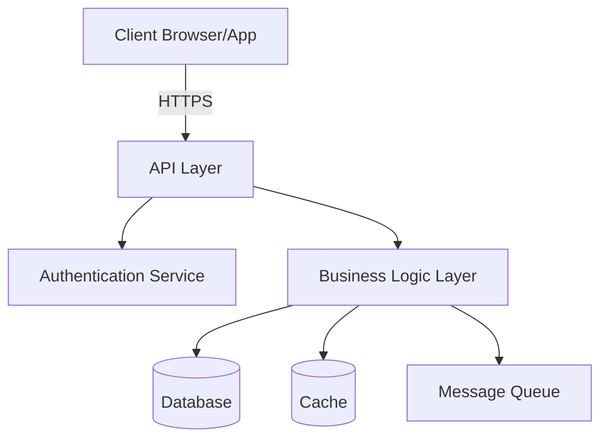
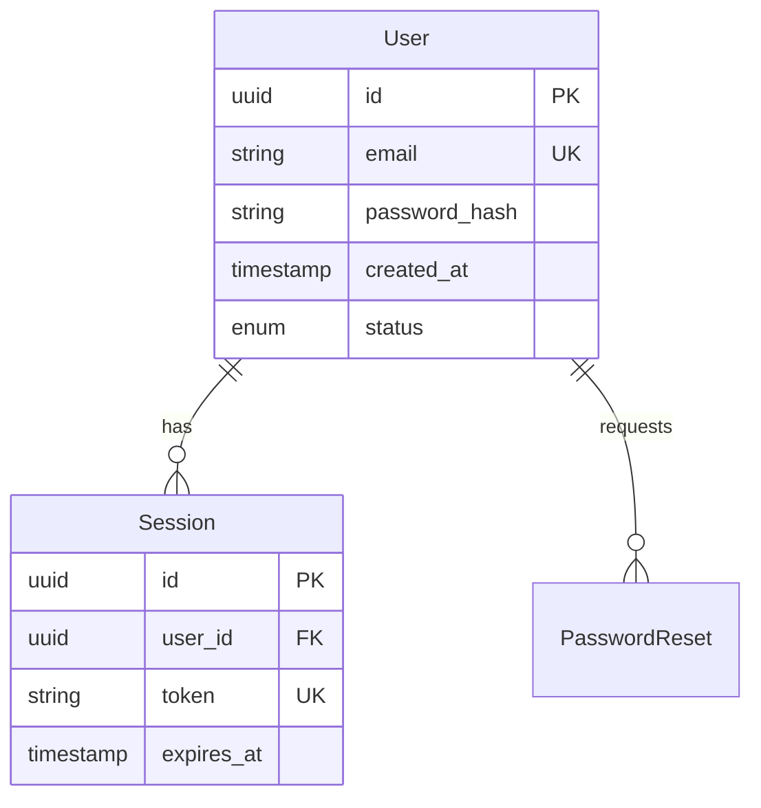
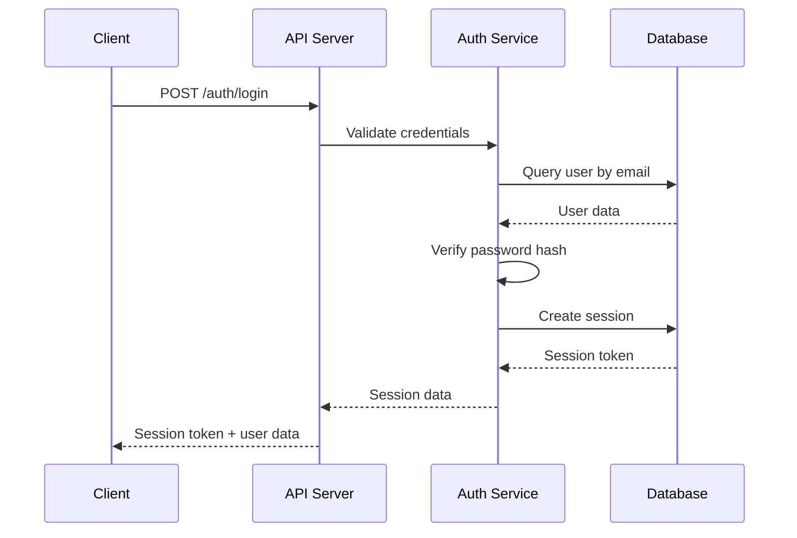
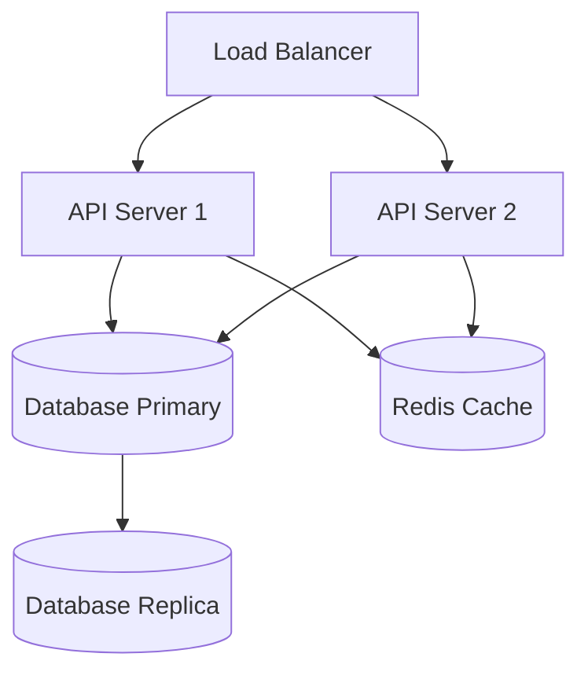

## User Input

```text
$ARGUMENTS
```

You **MUST** consider the user input before proceeding (if not empty).

## Outline

This command creates a complete system design from an existing feature specification. It uses Cursor's Composer mode for multi-file context and guides you through architecture decisions interactively.

### Step 0: Prerequisites

Verify that the feature specification exists:

```bash
bash .cursor/scripts/check-design-prerequisites.sh "$ARGUMENTS"
```

The script will:
- Verify spec file exists
- Check that agents.md exists
- Validate spec is complete (no placeholders)
- Output paths for spec, design file, and research file

If prerequisites fail, instruct user to complete spec first with `/spec-feature`.

### Step 1: Research & Resolve Unknowns

Before designing, identify and resolve technical unknowns from the spec.

**Scan spec for unknowns:**
- Technology choices mentioned but not justified
- Third-party integrations without alternatives evaluated
- Performance targets without implementation approach
- Security requirements without specific mechanisms
- Scalability needs without architecture strategy

**For each unknown, create research task:**

```bash
bash .cursor/scripts/create-research.sh "docs/specs/[feature-name].md"
```

This creates `docs/specs/[feature-name]-research.md` if unknowns found.

**Research Template for each unknown:**

```markdown
## Research Item: [Technology/Decision]

**Question**: [What do we need to decide?]

**Options Evaluated**:

### Option A: [Name]
- **Pros**: [Benefits]
- **Cons**: [Drawbacks]
- **Cost**: [Development time, hosting, licensing]
- **Complexity**: [Learning curve, maintenance]

### Option B: [Name]
- **Pros**: [Benefits]
- **Cons**: [Drawbacks]
- **Cost**: [Development time, hosting, licensing]
- **Complexity**: [Learning curve, maintenance]

**Decision**: [Chosen option]

**Rationale**: [Why this option - specific to project constraints from agents.md]

**Trade-offs Accepted**: [What we're giving up]
```

**Present research to user for approval** before proceeding to design.

### Step 2: Open Composer Mode

Instruct user to open Composer Mode for multi-file context:

```
Press Cmd+I (Mac) or Ctrl+I (Windows/Linux) to open Composer Mode
```

**Load these files into Composer context:**
- Spec file: `docs/specs/[feature-name].md`
- Research file: `docs/specs/[feature-name]-research.md` (if exists)
- Project standards: `.cursor/agents.md`
- Design template example: `.cursor/templates/design-template-example.md` (for reference on expected quality/detail)

### Step 3: Generate System Design

Using Composer Mode, create comprehensive system design.

**Prompt for Composer Mode:**

```markdown
Based on:
- Spec: docs/specs/[feature-name].md
- Research: docs/specs/[feature-name]-research.md
- Standards: .cursor/agents.md
- Template example: .cursor/templates/design-template-example.md

Create a system design at docs/specs/[feature-name]-design.md with:

1. Architecture Overview
2. Database Schema
3. API Contracts
4. Authentication & Authorization
5. Error Handling Strategy
6. Security Considerations
7. Performance Strategy
8. Deployment Architecture

Before generating, ask me questions about:
- Trade-offs between complexity and maintainability
- Data consistency vs. performance choices
- Security depth vs. development speed
- Technology choices alignment with team expertise
```

### Step 4: Interactive Design Questions

**Ask strategic questions before finalizing design:**

**Question Format:**

For each major design decision, present analysis and recommendation:

```markdown
Design Decision: [Topic - e.g., "Database Choice"]

**Context**: Based on spec requirements:
- [Requirement 1 from spec]
- [Requirement 2 from spec]
- [Constraint from agents.md]

**Recommended**: [Option] - [Why this is best for THIS project]

**Trade-offs**:
- ✅ Gets us: [Benefits specific to requirements]
- ❌ Costs us: [Drawbacks we're accepting]
- ⚖️  Alternative would give: [What we'd get with different choice]

**Alignment Check**:
- agents.md Architecture Principles: [How this aligns]
- agents.md Code Standards: [How this supports]

Approve recommendation or discuss alternatives?
```

**Categories for design decisions:**
1. **Data Storage** - Database choice, schema design, indexing strategy
2. **API Design** - REST vs GraphQL, versioning, authentication
3. **State Management** - Where state lives, consistency model
4. **Authentication** - Session vs token, storage mechanism
5. **Error Handling** - Logging strategy, user-facing errors, recovery
6. **Deployment** - Hosting choice, scaling strategy, environments

**Maximum 5 design decisions to discuss** - Focus on highest impact choices.

### Step 5: Create Design Document

Generate comprehensive design document:

```bash
bash .cursor/scripts/create-design.sh "docs/specs/[feature-name].md"
```

The script will:
- Create `docs/specs/[feature-name]-design.md` with template structure
- Output the file path for the AI to work with

**IMPORTANT**: The created file contains placeholder sections. Use `.cursor/templates/design-template-example.md` as your reference for:
- Expected level of detail in each section
- How to structure diagrams (Mermaid syntax)
- Code examples and SQL schemas
- Documentation style and completeness

**Design Document Structure:**

#### 1. Architecture Overview

```markdown
## Architecture Overview

### High-Level Architecture



### Component Responsibilities

**API Layer**:
- Request validation
- Authentication verification
- Rate limiting
- Response formatting

**Business Logic Layer**:
- Domain logic implementation
- Data validation
- Transaction management
- Event emission

**Data Layer**:
- Database queries
- Cache management
- Data consistency
```

#### 2. Database Schema

```markdown
## Database Schema

### Entity Relationship Diagram



### Table Definitions

#### Users Table

```sql
CREATE TABLE users (
    id UUID PRIMARY KEY DEFAULT gen_random_uuid(),
    email VARCHAR(255) UNIQUE NOT NULL,
    password_hash VARCHAR(60) NOT NULL,
    created_at TIMESTAMP DEFAULT CURRENT_TIMESTAMP,
    updated_at TIMESTAMP DEFAULT CURRENT_TIMESTAMP,
    email_verified BOOLEAN DEFAULT FALSE,
    status VARCHAR(20) DEFAULT 'active' CHECK (status IN ('active', 'inactive', 'locked')),
    failed_login_count INTEGER DEFAULT 0,
    locked_until TIMESTAMP,
    
    CONSTRAINT email_format CHECK (email ~* '^[A-Za-z0-9._%+-]+@[A-Za-z0-9.-]+\.[A-Z|a-z]{2,}$')
);

CREATE INDEX idx_users_email ON users(email);
CREATE INDEX idx_users_status ON users(status) WHERE status = 'active';
```

### Migrations Strategy

- Use sequential numbered migrations (001_initial_schema.sql)
- Each migration must be reversible (up/down)
- Test migrations on copy of production data before deploying
```

#### 3. API Contracts

```markdown
## API Contracts

### REST API Endpoints

#### POST /api/auth/register

**Purpose**: Create new user account

**Request**:
```json
{
  "email": "user@example.com",
  "password": "SecurePass123"
}
```

**Response (201 Created)**:
```json
{
  "user": {
    "id": "uuid",
    "email": "user@example.com",
    "created_at": "2026-01-11T10:30:00Z"
  },
  "session": {
    "token": "session-token",
    "expires_at": "2026-01-12T10:30:00Z"
  }
}
```

**Errors**:
- `400 Bad Request`: Invalid email format or weak password
  ```json
  {
    "error": "INVALID_EMAIL",
    "message": "Email address is not valid",
    "field": "email"
  }
  ```
- `409 Conflict`: Email already registered
  ```json
  {
    "error": "EMAIL_EXISTS",
    "message": "An account with this email already exists",
    "action": "login_or_reset"
  }
  ```

**Rate Limiting**: 5 requests per IP per minute
```

#### 4. Authentication & Authorization

```markdown
## Authentication & Authorization

### Authentication Flow



### Session Management

**Token Format**: Cryptographically random 64-character string
**Storage**: Database with expiration index
**Lifetime**: 24 hours of inactivity, extended on each request
**Validation**: On every authenticated request

### Authorization Rules

- Public endpoints: /auth/register, /auth/login, /auth/reset-password
- Authenticated endpoints: All others require valid session token
- Admin endpoints: Future - not in MVP
```

#### 5. Error Handling Strategy

```markdown
## Error Handling Strategy

### Error Categories

**Client Errors (4xx)**:
- 400 Bad Request: Invalid input data
- 401 Unauthorized: Missing/invalid authentication
- 403 Forbidden: Valid auth but insufficient permissions
- 404 Not Found: Resource doesn't exist
- 409 Conflict: Resource state conflict
- 429 Too Many Requests: Rate limit exceeded

**Server Errors (5xx)**:
- 500 Internal Server Error: Unexpected server error
- 503 Service Unavailable: Dependency failure

### Error Response Format

```json
{
  "error": "ERROR_CODE",
  "message": "User-friendly message",
  "field": "field_name",
  "details": {},
  "request_id": "uuid"
}
```

### Logging Strategy

**Log Levels**:
- ERROR: Server errors, data corruption, security events
- WARN: Rate limiting, validation failures, retry attempts
- INFO: Successful operations, state changes
- DEBUG: Detailed flow information (dev/staging only)

**Log Context**:
- request_id: UUID per request for tracing
- user_id: When authenticated
- ip_address: For security auditing
- endpoint: API route
- duration_ms: Request processing time

**Never Log**:
- Passwords (plain or hashed)
- Session tokens
- Sensitive user data
- Full request bodies with PII
```

#### 6. Security Considerations

```markdown
## Security Considerations

### Password Security

**Hashing**: bcrypt with cost factor 10
- Rationale: Balance security and performance (~250ms per hash)
- On login failure: Still compute hash to prevent timing attacks

**Password Requirements**:
- Minimum 8 characters
- Must contain letter and number
- No maximum length (hash handles any input)
- Check against common password list (top 10k)

### Session Security

**Token Generation**: crypto.randomBytes(32) → hex (64 chars)
**Storage**: Database only, never in logs
**Transmission**: HTTPS only, secure cookie with flags:
  - HttpOnly: Prevent XSS access
  - Secure: HTTPS only
  - SameSite=Strict: CSRF protection

### Rate Limiting

**Login Endpoint**: 5 attempts per IP per minute
**Registration**: 3 accounts per IP per hour
**Password Reset**: 3 requests per email per hour

**Implementation**: In-memory cache with sliding window

### Input Validation

**Email**: Regex validation + domain verification (optional)
**All Inputs**: Sanitize for SQL injection (use parameterized queries)
**Headers**: Validate content-type, origin, user-agent
```

#### 7. Performance Strategy

```markdown
## Performance Strategy

### Performance Targets (from spec)

- API responses < 500ms for 95% of requests
- Database queries < 100ms for 95% of queries
- Password hash computation: 250-350ms (bcrypt cost 10)

### Optimization Approaches

**Database**:
- Index frequently queried fields (email, token, expires_at)
- Use connection pooling (max 20 connections)
- Prepared statements for all queries

**Caching**:
- Session data: Cache for 5 minutes (reduce DB hits)
- Rate limit counters: In-memory only
- User lookup by email: Cache for 1 minute on login

**API**:
- Response compression (gzip)
- HTTP/2 for multiplexing
- CDN for static assets

### Monitoring

**Metrics to Track**:
- Request latency (p50, p95, p99)
- Database query time
- Cache hit rate
- Error rate by endpoint
- Active sessions count
```

#### 8. Deployment Architecture

```markdown
## Deployment Architecture

### Environments

**Development**: Local machine
- Database: PostgreSQL in Docker
- No email sending (log to console)
- Debug logging enabled

**Staging**: Cloud staging environment
- Database: Managed PostgreSQL
- Email: SendGrid test mode
- Production-like configuration

**Production**: Cloud production environment
- Database: Managed PostgreSQL with backups
- Email: SendGrid production
- Error logging enabled

### Infrastructure



### Deployment Process

1. Run database migrations
2. Deploy new code to staging
3. Run smoke tests
4. Deploy to production (rolling deployment)
5. Monitor error rates for 15 minutes
6. Rollback if error rate > 1%
```

### Step 6: Validate Design Against agents.md

Load `.cursor/agents.md` and validate design decisions:

**Validation Checklist:**

```markdown
## Design Validation

### Alignment with Code Standards
- [ ] Testing strategy defined for all components
- [ ] Security measures align with security standard
- [ ] Error handling follows standard (no internal errors exposed)
- [ ] Code formatting approach specified

### Alignment with Architecture Principles
- [ ] Design follows all MUST principles from agents.md
- [ ] Design considers all SHOULD principles from agents.md
- [ ] Deviations from principles are justified with rationale

### Technical Quality
- [ ] All components have clear responsibilities
- [ ] Data flow is unambiguous
- [ ] Failure modes identified
- [ ] Performance targets addressed
- [ ] Security threats mitigated

### Implementation Readiness
- [ ] All technology choices justified
- [ ] Dependencies documented
- [ ] Migration strategy defined
- [ ] Deployment approach clear
```

If validation fails, iterate on design until aligned.

### Step 7: Update agents.md (If Needed)

If design reveals new patterns or principles:

```markdown
## Updating agents.md

**New Architecture Principle Discovered?**
If this design reveals a reusable principle:

Example:
- Principle: "API-First Design"
- Rule: All features MUST have API endpoints before UI
- Rationale: Enables mobile app, easier testing, clear contracts
- Added: 2026-01-11

**Common Mistake Found During Design?**
If you discovered an anti-pattern:

Example:
- Mistake: "Storing session tokens in localStorage"
- Why wrong: XSS attacks can steal tokens
- Correct pattern: HttpOnly secure cookies
- Added: 2026-01-11
```

Prompt user: "Should we add any new principles or mistakes to agents.md based on this design?"

### Step 8: Report Completion

Display summary:

```markdown
✅ System design created!

📝 Files:
- Design: docs/specs/[feature-name]-design.md
- Research: docs/specs/[feature-name]-research.md (if created)

📊 Design Summary:
- Components: [count]
- Database Tables: [count]
- API Endpoints: [count]
- Security Measures: [count]

✅ Validation:
- Aligned with agents.md: ✓
- All components defined: ✓
- Failure modes addressed: ✓
- Performance targets met: ✓

🎯 Next Steps:
1. Review design for accuracy
2. Create implementation plan with /plan-tasks
3. Or refine design if needed

💡 Design Decisions Made:
- [Key decision 1]: [Choice + rationale]
- [Key decision 2]: [Choice + rationale]
- [Key decision 3]: [Choice + rationale]
```

## Guidelines

### For AI Generation

**Technology Choices:**
- Always justify with project-specific rationale
- Reference agents.md principles
- Consider team expertise (if known)
- Balance complexity vs. maintainability

**Architecture Diagrams:**
- Use Mermaid for all diagrams (renders in Markdown)
- Keep diagrams simple and focused
- One diagram per concept
- Label all connections

**Database Schema:**
- Include constraints, indexes, foreign keys
- Provide actual SQL (not pseudo-code)
- Consider migration strategy
- Think about data growth

**API Contracts:**
- Show request and response examples
- Document all error cases
- Include rate limiting
- Specify authentication requirements

**Security:**
- Threat model for each component
- Defense in depth (multiple layers)
- Align with security standard from agents.md
- Never rely on obscurity

### Design Quality Principles

1. **Explicit Over Implicit**: State assumptions clearly
2. **Defense in Depth**: Multiple security layers
3. **Fail Safely**: Failures don't expose data or corrupt state
4. **Observable**: Can monitor and debug in production
5. **Testable**: Components can be tested in isolation
6. **Scalable**: Architecture supports growth
7. **Maintainable**: Future developers can understand

### Common Design Mistakes to Avoid

❌ **Too Generic**: "We'll use a database" → Which one? Why?
❌ **No Trade-offs**: Every choice has costs, acknowledge them
❌ **Missing Failure Modes**: What breaks? How do we recover?
❌ **Premature Optimization**: Don't over-engineer for scale you don't need
❌ **Security Afterthought**: Security must be designed in, not added later
❌ **No Monitoring Strategy**: How do you know it's working in production?

## Context

Feature specification path: $ARGUMENTS