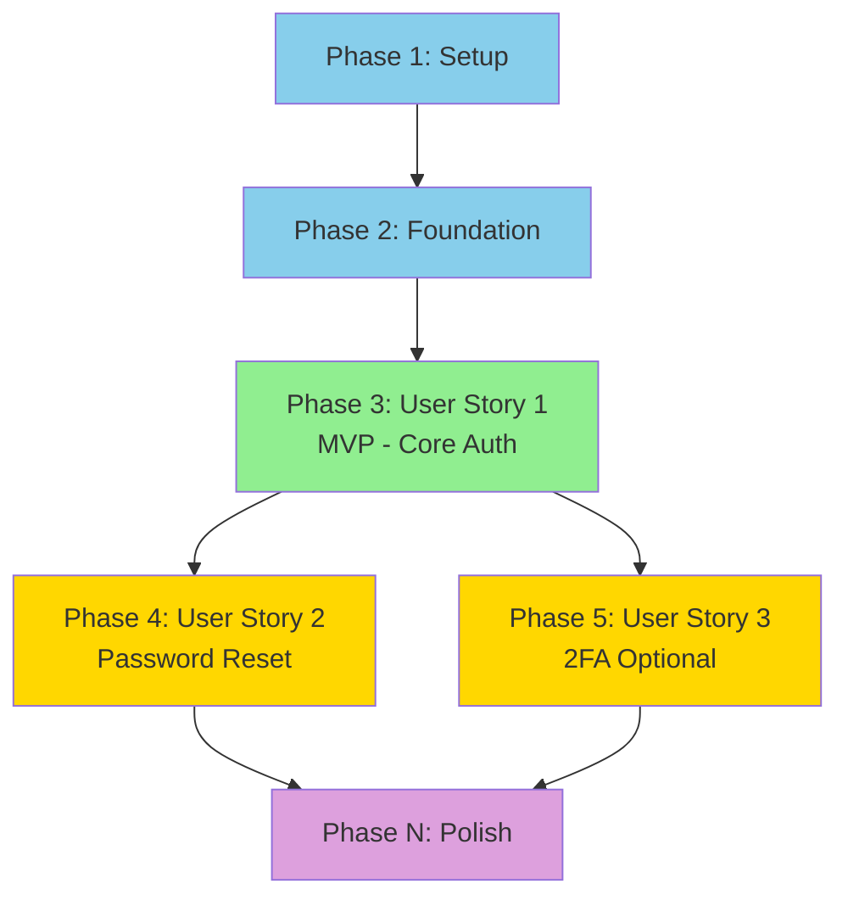

## User Input

```text
$ARGUMENTS
```

You **MUST** consider the user input before proceeding (if not empty).

## Outline

This command breaks down the system design into concrete implementation tasks organized by user story. It uses Cursor's Plan Mode to create a high-quality implementation plan before any code is written.

### Step 0: Prerequisites

Verify that spec and design exist:

```bash
bash .cursor/scripts/check-tasks-prerequisites.sh "$ARGUMENTS"
```

The script will:
- Verify spec file exists
- Verify design file exists
- Check that agents.md exists
- Output paths for all required files

If prerequisites fail, instruct user to complete spec and design first.

### Step 1: Open Plan Mode

**CRITICAL**: This command REQUIRES Plan Mode for best results.

**What is Plan Mode?**
Plan Mode is Cursor's planning interface (distinct from Composer Mode). It allows Claude to think through complex plans before committing to an approach, resulting in higher-quality task breakdowns.

**How to access:**
```
Press Shift+Tab+Tab to enter Plan Mode
```

**Why Plan Mode specifically?**
- Plan Mode creates significantly better task breakdowns than standard chat
- Allows AI to think through entire plan before generating tasks
- Better at handling complex dependencies and parallel work
- Optimized for strategic planning vs. implementation

### Step 2: Load Context into Plan Mode

Once in Plan Mode, load these files:

```markdown
Load into context:
- Spec: docs/specs/[feature-name]/spec.md
- Design: docs/specs/[feature-name]/design.md
- Research: docs/specs/[feature-name]/research.md (if exists)
- Standards: .cursor/agents.md
- Architecture patterns: .cursor/agent-docs/architecture.md (if exists)
- Database patterns: .cursor/agent-docs/database.md (if exists)
- API patterns: .cursor/agent-docs/api.md (if exists)
- Testing patterns: .cursor/agent-docs/testing.md (if exists)
- Existing codebase: [Scan for similar implementations in src/]
- Tasks template example: .cursor/templates/tasks-template-example.md (for reference on expected organization/detail)

**Before creating tasks, verify available patterns:**
- Check agents.md for project-specific conventions
- Check agent-docs/ for domain-specific patterns (API, database, testing, architecture)
- Scan codebase for similar implementations to reference
- Review research.md for technical decisions already made
```

### Step 3: Generate Task Plan Outline

Using Plan Mode, create an implementation plan outline:

```markdown
Based on:
- Spec with user stories (P1/P2/P3)
- Design with architecture and database schema
- Project standards from agents.md
- Template example from .cursor/templates/tasks-template-example.md

Create a task breakdown that:

1. **Organizes by User Story** (CRITICAL)
   - Phase 1: Setup
   - Phase 2: Foundation (blocking prerequisites)
   - Phase 3: User Story 1 (P1 - MVP)
   - Phase 4: User Story 2 (P2)
   - Phase 5: User Story 3 (P3)
   - Phase N: Polish & Cross-Cutting

2. **Makes each story independently testable**
   - What test proves this story works?
   - Can I test without other stories complete?

3. **Identifies parallelizable work**
   - Which tasks touch different files?
   - Which tasks have no dependencies?

4. **Defines MVP scope**
   - Usually just User Story 1
   - What's minimum to validate core value?

Before generating tasks, present the outline for approval.
```

**Ask strategic questions:**

```markdown
Planning Questions:

1. **MVP Scope**: Spec has [N] user stories (P1/P2/P3).
   - Recommend: P1 only for MVP (validate core value first)
   - Alternative: P1 + P2 (if P2 is critical for usability)
   - Your preference?

2. **Testing Approach**: 
   - Option A: Write tests alongside implementation (TDD)
   - Option B: Write tests after implementation (test-after)
   - Option C: Only test critical paths (minimal)
   - Recommendation: [Based on agents.md testing standard]
   - Your preference?

3. **Implementation Order** within each story:
   - Recommend: Database → Business Logic → API → Tests → Integration
   - This order catches data model issues early
   - Alternative order if needed?

4. **Parallel Work**: 
   - Can we work on multiple stories simultaneously?
   - Recommend: Complete P1 fully before starting P2 (avoid partial features)
   - Your preference?
```

### Step 4: Create Task Breakdown

After outline approved, generate detailed task breakdown:

```bash
bash .cursor/scripts/create-tasks.sh "docs/specs/[feature-name].md"
```

The script will:
- Create feature directory: `docs/specs/[feature-name]/`
- Create `docs/specs/[feature-name]/tasks.md` with template structure
- Output the file path for the AI to work with

**IMPORTANT**: The created file contains placeholder sections. Use `.cursor/templates/tasks-template-example.md` as your reference for:
- Expected task organization by phase
- Task format and labeling conventions
- Independent test scenario structure
- MVP definition clarity
- Dependency graph examples

### Step 5: Populate Tasks with Detailed, Self-Contained Format

**CRITICAL**: Tasks must be self-contained and detailed enough to be implemented without loading other tasks. This enables `/do-task` to work effectively (one task at a time).

**Before finalizing each task, verify:**

1. **Check existing patterns**: 
   - Does agents.md have patterns/conventions for this?
   - Does agent-docs/ have domain-specific patterns (API, database, testing)?
   - Are there similar implementations in the codebase to reference?

2. **Check design completeness**:
   - Does design doc provide enough detail for this task?
   - Are all fields, methods, and requirements specified?
   - Are error handling requirements clear?

3. **Flag if research needed**:
   - If task introduces new technology not in design/research → Add [RESEARCH] marker
   - If requirements are ambiguous → Add [RESEARCH] marker with clarification needed
   - If no existing patterns found → Add [RESEARCH] marker with what to research

4. **Extract details into task**:
   - Don't say "see design doc" - extract relevant details into task
   - Don't say "follow standard pattern" - specify the pattern
   - Include all context needed to implement without loading other files

**TASK FORMAT** - Every task MUST follow this pattern:

```
- [ ] [TaskID] [P?] [Story?] [RESEARCH?] Description with file path

  **File**: [exact file path]
  
  **Requirements** (from design):
  - [Detailed requirement 1]
  - [Detailed requirement 2]
  
  **Implementation Details**:
  - [Specific implementation detail 1]
  - [Specific implementation detail 2]
  
  **Error Handling**:
  - [Error handling requirements]
  
  **Dependencies**: [Task IDs that must be complete first]
  
  **Acceptance**: [How to verify this task is complete]
```

**Optional [RESEARCH] Marker**: Use only if task needs additional investigation:
- New technology not covered in design/research
- Ambiguous requirements needing clarification
- No existing patterns in agents.md or agent-docs/
- Similar implementations not found in codebase

If [RESEARCH] marker is used, add:
```
  **Research Needed**:
  - Check agents.md for: [specific pattern or convention]
  - Review codebase for: [similar implementation to reference]
  - Verify in agent-docs/: [specific domain pattern]
  - Clarify with design: [specific ambiguity]
```

**Format Rules:**

1. **Checkbox**: Always start with `- [ ]`
2. **Task ID**: Sequential number (T001, T002, T003...)
3. **[P] Marker**: ONLY if task is parallelizable
   - Different files than other running tasks
   - No dependencies on incomplete tasks
   - Example: `[P]`
4. **[Story] Label**: REQUIRED for user story phases
   - Format: [US1], [US2], [US3], etc.
   - Setup phase: NO story label
   - Foundation phase: NO story label
   - User Story phases: MUST have story label
   - Polish phase: NO story label
5. **[RESEARCH] Marker**: OPTIONAL, use only if task needs additional investigation
   - New technology not in design/research
   - Ambiguous requirements
   - No existing patterns found
   - Example: `[RESEARCH]`
6. **Description**: Clear action with exact file path
7. **Detailed Requirements**: Self-contained details extracted from design
8. **Dependencies**: Explicitly listed (not inferred)

**Examples:**

✅ CORRECT (Detailed, Self-Contained):
```
- [ ] T017 [P] [US1] Create User model in src/models/user.js

  **File**: src/models/user.js
  
  **Fields** (from design):
  - id: UUID (primary key, auto-generated)
  - email: string (unique, required, validated with regex)
  - password_hash: string (required, bcrypt hashed, never plain text)
  - email_verified: boolean (default: false)
  - status: enum('active', 'inactive') (default: 'active')
  - failed_login_count: integer (default: 0)
  - locked_until: timestamp (nullable, null means not locked)
  
  **Methods** (from design):
  - create(userData): Create new user, hash password using bcrypt cost 10, return user object
  - findByEmail(email): Find user by email, return user object or null
  - updateFailedLoginCount(userId): Increment failed_login_count by 1
  - lockAccount(userId, durationMinutes): Set locked_until to now + durationMinutes
  
  **Error Handling**:
  - Use ValidationError from src/errors/validation-error.js for invalid input
  - Use DatabaseError from src/errors/database-error.js for DB failures
  - Never expose internal errors to callers (per agents.md)
  
  **Patterns to Follow** (from agents.md/agent-docs/):
  - Model structure: Follow pattern from src/models/product.js (if exists)
  - Error handling: Per agent-docs/database.md conventions
  - Field validation: Per agents.md code standards
  
  **Dependencies**: T008-T016 (Foundation tasks must be complete)
  
  **Acceptance**: User model can be imported, instantiated, and all methods work correctly
```

✅ CORRECT (With Research Marker):
```
- [ ] T042 [US2] [RESEARCH] Integrate SendGrid email service in src/services/email-service.js

  **File**: src/services/email-service.js
  
  **Research Needed**:
  - Check agents.md for: Email service patterns or third-party integration conventions
  - Review codebase for: Similar third-party service integrations (e.g., payment service)
  - Verify in agent-docs/: API integration patterns
  - Clarify with design: Email template structure and error handling strategy
  
  **Requirements** (from design):
  - Send password reset emails via SendGrid API
  - Include reset link with expiration notice
  - Handle API errors gracefully (don't fail user request)
  
  **Implementation Details**:
  - Use SendGrid Node.js SDK
  - Template: Password reset email with company branding
  - Error handling: Log SendGrid errors, return success to user (security)
  
  **Dependencies**: T035 (PasswordResetService)
  
  **Acceptance**: Emails send successfully, errors logged but don't expose to users
```

✅ CORRECT (Simpler task, still detailed):
```
- [ ] T001 Initialize project structure per implementation plan

  **Files**: Create directories: src/, tests/, config/
  
  **Requirements**:
  - Create src/ directory with subdirectories: models/, services/, routes/, middleware/
  - Create tests/ directory with subdirectories: unit/, integration/
  - Create config/ directory for configuration files
  - Create .gitignore with standard Node.js ignores
  
  **Dependencies**: None (first task)
  
  **Acceptance**: All directories exist, .gitignore created
```

❌ WRONG (Too brief, not self-contained):
```
- [ ] T017 [US1] Create User model in src/models/user.js
  - Fields: id, email, password_hash...
  - Methods: create(), findByEmail()...
```
Problem: Missing field types, method signatures, error handling, dependencies

❌ WRONG (Missing required elements):
```
- [ ] Create User model  (missing ID and Story label)
T001 [US1] Create model  (missing checkbox)
- [ ] [US1] Create User model  (missing Task ID)
- [ ] T001 [US1] Create model  (missing file path)
```

❌ WRONG (Research marker without research section):
```
- [ ] T042 [RESEARCH] Integrate SendGrid email service
  - Use SendGrid API
  - Send emails
```
Problem: [RESEARCH] marker used but no "Research Needed" section provided

### Step 6: Organize Tasks by Phase

**Phase Structure:**

#### Phase 1: Setup
```markdown
## Phase 1: Setup

**Goal**: Initialize project structure and dependencies

**Tasks**:
- [ ] T001 Initialize project structure (src/, tests/, config/)
- [ ] T002 Install dependencies from package.json
- [ ] T003 Configure environment variables (.env.example)
- [ ] T004 Setup database connection and pool
- [ ] T005 [P] Create ignore files (.gitignore, .dockerignore)
```

#### Phase 2: Foundation (Blocking Prerequisites)
```markdown
## Phase 2: Foundation

**Goal**: Build shared infrastructure required by all user stories

**What makes this foundation**:
- Shared utilities used by multiple stories
- Database schema (all tables)
- Authentication middleware
- Error handling
- Logging setup

**Tasks**:
- [ ] T006 Run database migrations (all tables)
- [ ] T007 [P] Create base error classes in src/errors/
- [ ] T008 [P] Setup logging with Winston in src/utils/logger.js
- [ ] T009 Create database query helpers in src/db/
- [ ] T010 [P] Setup test framework (Jest/Mocha)
```

#### Phase 3+: User Stories (One Phase Per Story)
```markdown
## Phase 3: User Story 1 (P1 - MVP) - [Story Name from Spec]

**Story Goal**: [Exact goal from spec]

**Acceptance Criteria** (from spec):
- [ ] [Criterion 1]
- [ ] [Criterion 2]

**Independent Test**: 
How to verify this story works without other stories:
- [Specific test scenario]
- Expected outcome: [What user sees/system does]

**Tasks**:

- [ ] T011 [P] [US1] Create User model in src/models/user.js

  **File**: src/models/user.js
  
  **Fields** (from design):
  - id: UUID (primary key, auto-generated)
  - email: string (unique, required, validated)
  - password_hash: string (required, bcrypt hashed)
  - email_verified: boolean (default: false)
  - status: enum('active', 'inactive') (default: 'active')
  - failed_login_count: integer (default: 0)
  - locked_until: timestamp (nullable)
  
  **Methods** (from design):
  - create(userData): Hash password, insert user, return user object
  - findByEmail(email): Find user by email, return user or null
  - updateFailedLoginCount(userId): Increment failed_login_count
  - lockAccount(userId, durationMinutes): Set locked_until timestamp
  
  **Error Handling**: Use ValidationError, DatabaseError from src/errors/
  
  **Dependencies**: T008-T016 (Foundation tasks)
  
  **Acceptance**: Model can be imported, all methods work

- [ ] T012 [P] [US1] Create Session model in src/models/session.js

  **File**: src/models/session.js
  
  **Fields** (from design):
  - id: UUID (primary key)
  - user_id: UUID (foreign key to users.id)
  - token: string (64 random bytes as hex, unique)
  - created_at: timestamp (default: now)
  - expires_at: timestamp (required, 24 hours from creation)
  - last_activity_at: timestamp (default: now, updated on use)
  
  **Methods** (from design):
  - create(userId, token): Create session, return session object
  - findByToken(token): Find session by token, return session or null
  - updateActivity(sessionId): Update last_activity_at to now
  - delete(sessionId): Delete session by ID
  
  **Error Handling**: Use DatabaseError for DB failures
  
  **Dependencies**: T008-T016 (Foundation tasks)
  
  **Acceptance**: Model can be imported, all methods work

- [ ] T013 [US1] Implement UserService in src/services/user-service.js

  **File**: src/services/user-service.js
  
  **Methods** (from design):
  - hashPassword(password): Hash using bcrypt cost 10, return hash string
  - validateEmail(email): Validate format with regex, return boolean
  - createUser(email, password): Validate email, hash password, call User.create(), return user object
  
  **Error Handling**:
  - ValidationError for invalid email format
  - ValidationError for weak password (per design requirements)
  - DatabaseError for duplicate email (409 conflict)
  
  **Dependencies**: T011 (User model must exist)
  
  **Acceptance**: All methods work, error handling correct

- [ ] T014 [US1] Implement AuthService in src/services/auth-service.js

  **File**: src/services/auth-service.js
  
  **Methods** (from design):
  - login(email, password): Verify credentials, track failures, create session, return session token
  - handleFailedLogin(userId): Increment failed_login_count, lock if >= 5 failures
  - generateSessionToken(): Generate 64 random bytes as hex string
  - checkAccountLock(user): Verify not locked or lock expired, return boolean
  
  **Error Handling**:
  - AuthError for invalid credentials (401)
  - AuthError for locked account (423)
  
  **Dependencies**: T011 (User model), T012 (Session model), T013 (UserService)
  
  **Acceptance**: Login flow works, account lockout works after 5 failures

- [ ] T015 [US1] Create POST /api/auth/register endpoint in src/routes/auth.js

  **File**: src/routes/auth.js (create or add to existing)
  
  **Endpoint**: POST /api/auth/register
  
  **Request Body**: { email: string, password: string }
  
  **Validation**:
  - Email format (per UserService.validateEmail)
  - Password requirements (8+ chars, letter + number)
  
  **Logic**:
  - Call UserService.createUser()
  - Create session using Session.create()
  - Return 201 with user object and session token
  
  **Error Handling**:
  - 400 for validation errors
  - 409 for duplicate email
  
  **Dependencies**: T013 (UserService), T012 (Session model)
  
  **Acceptance**: Endpoint accepts valid requests, returns 201 with token

- [ ] T016 [US1] Create POST /api/auth/login endpoint in src/routes/auth.js

  **File**: src/routes/auth.js
  
  **Endpoint**: POST /api/auth/login
  
  **Request Body**: { email: string, password: string }
  
  **Logic**:
  - Call AuthService.login()
  - Track failed attempts
  - Return 200 with session token
  
  **Error Handling**:
  - 401 for invalid credentials
  - 423 for locked account
  
  **Dependencies**: T014 (AuthService)
  
  **Acceptance**: Endpoint accepts valid credentials, returns 200 with token

- [ ] T017 [US1] Create authentication middleware in src/middleware/auth.js

  **File**: src/middleware/auth.js
  
  **Functionality**:
  - Extract token from Authorization header (Bearer <token>)
  - Validate session using Session.findByToken()
  - Check expiration (expires_at > now)
  - Update activity using Session.updateActivity()
  - Attach user to request object (req.user)
  
  **Error Handling**:
  - 401 for missing/invalid token
  - 401 for expired session
  
  **Dependencies**: T012 (Session model)
  
  **Acceptance**: Middleware validates tokens, attaches user to request

- [ ] T018 [P] [US1] Write unit tests for UserService in tests/unit/user-service.test.js

  **File**: tests/unit/user-service.test.js
  
  **Test Cases**:
  - hashPassword creates valid bcrypt hash
  - validateEmail accepts valid emails, rejects invalid
  - createUser inserts user correctly
  - createUser rejects weak passwords
  - createUser rejects duplicate emails
  
  **Dependencies**: T013 (UserService implemented)
  
  **Acceptance**: All tests pass, coverage > 80%

- [ ] T019 [P] [US1] Write unit tests for AuthService in tests/unit/auth-service.test.js

  **File**: tests/unit/auth-service.test.js
  
  **Test Cases**:
  - login succeeds with valid credentials
  - login fails with invalid password
  - failed login count increments
  - account locks after 5 failures
  - locked account rejects login
  - lock expires after 15 minutes
  
  **Dependencies**: T014 (AuthService implemented)
  
  **Acceptance**: All tests pass, coverage > 80%

- [ ] T020 [US1] Write integration tests for auth endpoints in tests/integration/auth.test.js

  **File**: tests/integration/auth.test.js
  
  **Test Cases**:
  - POST /auth/register happy path
  - POST /auth/register with invalid email
  - POST /auth/register with weak password
  - POST /auth/register with duplicate email
  - POST /auth/login happy path
  - POST /auth/login with invalid credentials
  - POST /auth/login account lockout
  - GET /auth/me with valid token
  - GET /auth/me with invalid token
  
  **Dependencies**: T015, T016, T017 (All endpoints and middleware)
  
  **Acceptance**: All integration tests pass

- [ ] T021 [US1] Verify story completion (manual test scenario)

  **Action**: Run independent test scenario from story definition
  
  **Dependencies**: All previous tasks complete
  
  **Acceptance**: All test scenario steps pass
```

**Important**: Each story phase follows same structure:
- Story goal from spec
- Acceptance criteria from spec
- Independent test scenario
- Tasks (Data models → Services → API → Tests → Verification)

#### Final Phase: Polish & Cross-Cutting
```markdown
## Phase N: Polish & Cross-Cutting Concerns

**Goal**: Production readiness and final improvements

**Tasks**:
- [ ] T0XX [P] Add input validation to all endpoints
- [ ] T0XX [P] Add rate limiting middleware
- [ ] T0XX [P] Setup monitoring (metrics, logging)
- [ ] T0XX [P] Write API documentation (OpenAPI/Swagger)
- [ ] T0XX [P] Add security headers (helmet.js)
- [ ] T0XX Performance optimization based on profiling
- [ ] T0XX Final integration test (all stories together)
```

### Step 7: Create Dependency Graph

Generate visual dependency graph:

```markdown
## Dependencies & Execution Flow

### Story Completion Order



### Parallel Execution Opportunities

**Within User Story 1**:
- T011, T012 (models) can run in parallel
- T018, T019 (unit tests) can run in parallel

**Across Stories** (if multi-developer team):
- After US1 complete: US2 and US3 can start in parallel
- Polish tasks mostly parallelizable

**Single Developer Recommendation**:
- Complete US1 fully before starting US2
- Avoid context switching between stories
```

### Step 8: Define MVP Scope

```markdown
## MVP Definition

**Minimum Viable Product** = Phase 1 + Phase 2 + Phase 3 (User Story 1)

**What you get**:
- [Specific user capability from US1]
- [Another capability from US1]

**What you defer**:
- Phase 4 (User Story 2): [Feature name]
- Phase 5 (User Story 3): [Feature name]

**Why this MVP**:
- Validates core value proposition
- Can be tested by real users
- Provides foundation for additional stories
- ~[X] days of development

**Success Metrics** (from spec success criteria):
- [Measurable outcome 1]
- [Measurable outcome 2]
```

### Step 9: Validate Task Breakdown

Run validation script:

```bash
bash .cursor/scripts/validate-tasks.sh "docs/specs/[feature-name]/tasks.md"
```

**Validation checks:**
- [ ] All tasks follow format: `- [ ] [TaskID] [P?] [Story?] [RESEARCH?] Description`
- [ ] Task IDs are sequential (T001, T002, T003...)
- [ ] Every user story phase has [US1], [US2] labels on tasks
- [ ] Setup and Foundation phases have NO story labels
- [ ] Each story has independent test defined
- [ ] File paths included in task descriptions
- [ ] Dependencies are logical (no circular dependencies)
- [ ] MVP scope clearly defined
- [ ] Verification tasks included at key milestones (models, services, API, tests, story)
- [ ] Verification tasks have clear acceptance criteria
- [ ] Tasks with [RESEARCH] marker include "Research Needed" section
- [ ] Tasks reference existing patterns from agents.md/agent-docs/ where applicable

If validation fails, fix issues and re-validate.

### Step 10: Validate Against agents.md

Check task breakdown against project standards:

```markdown
## Validation Against agents.md

**Code Standards Alignment**:
- [ ] Testing tasks included (per testing standard)
- [ ] Security tasks included (per security standard)
- [ ] Error handling approach follows standard
- [ ] Code formatting approach specified

**Architecture Principles Alignment**:
- [ ] Tasks implement all MUST principles
- [ ] Tasks consider all SHOULD principles
- [ ] Deviations have documented rationale

**Completeness**:
- [ ] Every requirement from spec has tasks
- [ ] Every component from design has tasks
- [ ] All database tables have creation tasks
- [ ] All API endpoints have implementation tasks

**Pattern Alignment**:
- [ ] Tasks reference existing patterns from agents.md where applicable
- [ ] Tasks reference domain patterns from agent-docs/ where applicable
- [ ] Tasks note similar codebase implementations to reference
- [ ] Research markers used appropriately (only when needed)

**Feasibility**:
- [ ] Task granularity appropriate (~30-60 min each)
- [ ] No tasks require unspecified technology
- [ ] Dependencies can be completed in order
```

### Step 11: Report Completion

Display summary:

```markdown
✅ Implementation plan created!

📝 File: docs/specs/[feature-name]/tasks.md

📊 Task Summary:
- Total Tasks: [count]
- Setup: [count]
- Foundation: [count]
- User Story 1 (MVP): [count]
- User Story 2: [count]
- User Story 3: [count]
- Polish: [count]

🎯 MVP Scope:
- Phases: Setup + Foundation + User Story 1
- Tasks: [count] tasks
- Estimated: ~[X] days

📈 Parallel Opportunities:
- [N] tasks marked [P] for parallel execution
- Within stories: [specific tasks]
- Across stories: [if applicable]

✅ Validation:
- Task format: ✓
- User story organization: ✓
- Dependencies logical: ✓
- MVP clearly defined: ✓
- Aligned with agents.md: ✓

🎯 Next Steps:
1. Review task breakdown for accuracy
2. Verify tasks are self-contained (can be understood without design doc)
3. Start implementation with:
   - `/do-task` (one task at a time, maximum focus)
   - OR `/implement-story "User Story 1"` (full story context)
4. Complete MVP before adding P2/P3 features

💡 Implementation Tips:
- Work story-by-story (don't jump between stories)
- Each story should work independently
- Test each story fully before moving to next
- Update agents.md with learnings as you go
- Tasks are now self-contained - perfect for `/do-task` workflow
```

## Guidelines

### Task Organization Principles

**1. User Story Organization (CRITICAL)**

Why organize by user story instead of sequential tasks?

- **Independent Testing**: Each story can be tested without others
- **Incremental Value**: Each story delivers user value
- **Parallel Work**: Different developers can work on different stories
- **Clear Progress**: "US1 complete" is meaningful milestone
- **Easier Review**: Review story-by-story, not scattered tasks

**Bad (Sequential)**:
```
- Create all models (T001-T010)
- Create all services (T011-T020)
- Create all endpoints (T021-T030)
- Create all tests (T031-T040)
```
Problem: Can't test anything until everything done.

**Good (By User Story)**:
```
US1: Create User model → Service → Endpoint → Test (working feature)
US2: Create Password Reset model → Service → Endpoint → Test (working feature)
```
Benefit: US1 is fully testable before US2 starts.

**2. MVP First**

- Always complete P1 (User Story 1) fully first
- This validates core value proposition
- Proves technical approach works
- Provides foundation for other stories
- Typically 30-50% of total work

**3. Independent Testing**

Each user story phase MUST define how to test it independently:

```markdown
**Independent Test for US1**: 
1. Start server
2. POST /auth/register with valid email/password
3. Verify: Receive session token
4. POST /auth/login with same credentials
5. Verify: Receive session token
6. GET /auth/me with token
7. Verify: Receive user profile

Success = All steps work without US2 or US3 implemented
```

**4. Parallel Task Marking**

Mark tasks [P] ONLY if they:
- Modify different files
- Have no dependencies on incomplete tasks
- Can be safely worked on simultaneously

Example:
```
- [ ] T011 [P] [US1] Create User model in src/models/user.js
- [ ] T012 [P] [US1] Create Session model in src/models/session.js
```
These are parallel because different files, no dependencies.

```
- [ ] T013 [US1] Create UserService (depends on User model)
- [ ] T014 [US1] Create AuthService (depends on UserService)
```
These are NOT parallel - must be sequential.

### Verification Tasks

**CRITICAL**: Include explicit verification tasks at key milestones. These ensure quality and catch issues early.

**Verification Task Placement**:

1. **After Models** (after all model tasks in a story):
   - Verify files exist, syntax valid, methods present
   - Can import and use models
   - Example: T021 [US1] Verify models milestone (T017, T018)

2. **After Services** (after all service tasks):
   - Verify services work with models
   - Business logic matches design
   - Error handling correct
   - Example: T022 [US1] Verify services milestone (T019, T020)

3. **After API** (after all API/endpoint tasks):
   - Verify all endpoints exist and work
   - Manual testing with curl/Postman
   - Error responses correct
   - Example: T023 [US1] Verify API milestone (T021-T024)

4. **After Tests** (after all test tasks):
   - Run automated test suite
   - Verify coverage meets requirements
   - No linting errors
   - Example: T024 [US1] Verify tests milestone (T025-T027)

5. **After Story** (after all tasks in story):
   - Run independent test scenario
   - Verify story works end-to-end
   - Example: T025 [US1] Verify story completion

**Verification Task Format**:
- Include verification type (Milestone Checkpoint or Story-Level Verification)
- List all dependencies (which tasks must be complete)
- Specify checks to run (automated and manual)
- Define acceptance criteria (what "pass" means)

**Benefits**:
- Makes verification mandatory (can't skip)
- Shows up in progress tracking
- Works well with `/do-task` (one task at a time)
- Catches issues early (before moving to next milestone)
- Provides clear checkpoints for review

### Task Granularity

**Good Task Size**: 30-60 minutes of focused work

**Too Small**:
```
- [ ] T001 Import bcrypt
- [ ] T002 Write hash function
- [ ] T003 Write verify function
```
Combine: "Implement password hashing with bcrypt"

**Too Large**:
```
- [ ] T001 Implement entire authentication system
```
Break down: Registration → Login → Session → Verification

**Just Right** (Detailed, Self-Contained):
```
- [ ] T013 [US1] Implement UserService in src/services/user-service.js

  **File**: src/services/user-service.js
  
  **Methods**:
  - hashPassword(password): Hash using bcrypt cost 10
  - validateEmail(email): Validate format with regex
  - createUser(email, password): Hash password, insert user, return user object
  
  **Error Handling**: ValidationError for invalid input, DatabaseError for DB failures
  
  **Dependencies**: T011 (User model)
  
  **Acceptance**: All methods work, error handling correct
```

### Testing Task Rules

**If testing standard in agents.md requires tests:**
- Include test tasks for each component
- Place test tasks after implementation tasks in same story
- Mark test tasks [P] if they test different components

**If TDD approach:**
- Test task BEFORE implementation task
- Example: T018 Write UserService tests → T019 Implement UserService

**If test-after approach:**
- Implementation task first
- Test task after: T018 Implement UserService → T019 Test UserService

**Minimal testing:**
- Only integration tests for critical paths
- Unit tests only for complex business logic

### Common Mistakes to Avoid

❌ **Not organizing by user story**
- Tasks scattered by type instead of feature
- Can't test partially complete work

❌ **Missing file paths**
- "Create User model" → Where?
- Should be: "Create User model in src/models/user.js"

❌ **Incorrect story labels**
- Setup tasks with [US1] label
- Missing [US1] label on story-specific tasks

❌ **No independent test defined**
- Can't verify story works without other stories

❌ **Wrong parallel markers**
- Marking dependent tasks as [P]
- Not marking clearly parallel tasks

❌ **Vague descriptions**
- "Handle errors" → Which errors? How?
- "Add validation" → Which fields? What rules?

❌ **Tasks not self-contained**
- "Create User model" → What fields? What methods? What types?
- "Implement service" → Which methods? What do they do?
- Tasks that require loading design doc to understand

❌ **Missing pattern references**
- "Create model" → Which pattern from agents.md?
- "Implement API endpoint" → Which conventions from agent-docs/api.md?
- Not checking for similar implementations in codebase

❌ **Inappropriate research markers**
- Using [RESEARCH] for tasks with clear patterns in agents.md
- Using [RESEARCH] without providing "Research Needed" section
- Not using [RESEARCH] when task introduces new technology

❌ **Missing MVP definition**
- No clear line between must-have and nice-to-have

### Task Self-Containment Requirements

**CRITICAL**: For `/do-task` to work effectively, each task must be self-contained. This means:

**DO Include:**
- Exact file paths
- All fields with types and constraints
- All methods with signatures and behavior
- Error handling requirements
- Dependencies explicitly listed
- Acceptance criteria for the task
- Implementation approach (if non-obvious)

**DON'T Rely On:**
- "See design doc for details" (extract details into task)
- "Similar to T011" (include full details)
- "Standard pattern" (specify the pattern)
- Implied dependencies (list them explicitly)
- "Follow existing pattern" (reference the specific pattern from agents.md/agent-docs/)

**DO Reference:**
- Specific patterns from agents.md: "Per agents.md model conventions..."
- Domain patterns from agent-docs/: "Follow agent-docs/api.md endpoint structure..."
- Similar codebase files: "Reference src/models/product.js for structure..."
- Research decisions: "Per research.md decision on email service..."

**Example of Self-Contained Task:**

✅ **Good**:
```
- [ ] T017 [US1] Create User model in src/models/user.js

  **File**: src/models/user.js
  
  **Fields**:
  - id: UUID (primary key, auto-generated)
  - email: string (unique, required, validated with regex)
  - password_hash: string (required, bcrypt hashed)
  ...
  
  **Methods**:
  - create(userData): Create new user, hash password, return user object
  ...
  
  **Patterns to Follow**:
  - Model structure: Reference src/models/product.js (similar pattern)
  - Error handling: Per agent-docs/database.md conventions
  - Field validation: Per agents.md code standards
  
  **Dependencies**: T008-T016
  
  **Acceptance**: Model can be imported, all methods work
```

❌ **Bad** (not self-contained):
```
- [ ] T017 [US1] Create User model in src/models/user.js
  - See design doc for fields and methods
  - Follow standard model pattern
```

❌ **Bad** (missing pattern references):
```
- [ ] T017 [US1] Create User model in src/models/user.js
  - Fields: id, email, password_hash...
  - Methods: create(), findByEmail()...
```
Problem: Doesn't reference existing patterns or similar implementations

## Context

Feature specification and design paths: $ARGUMENTS