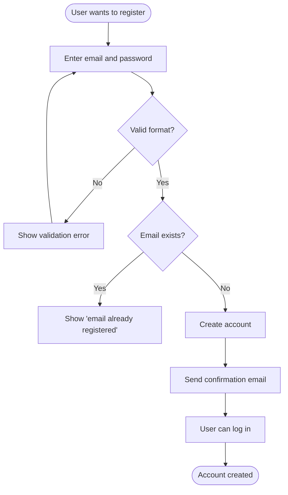
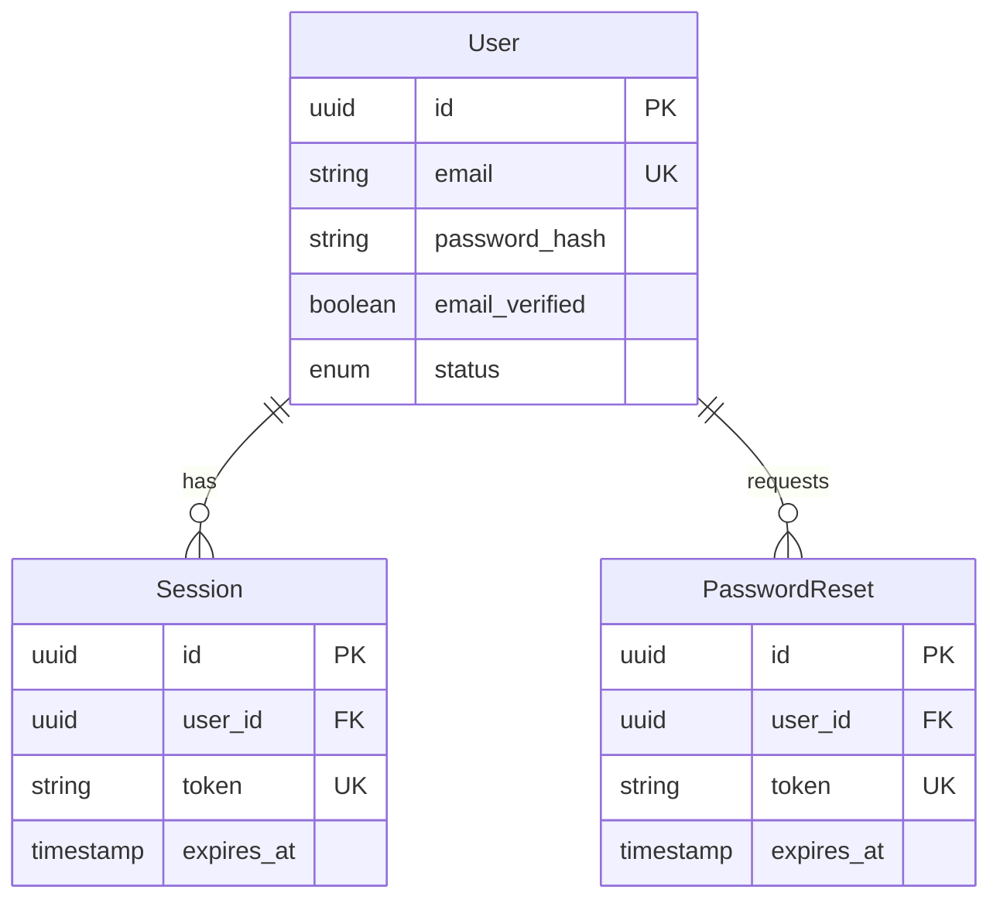
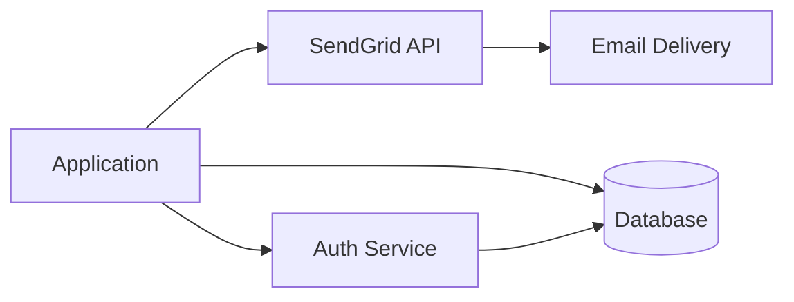
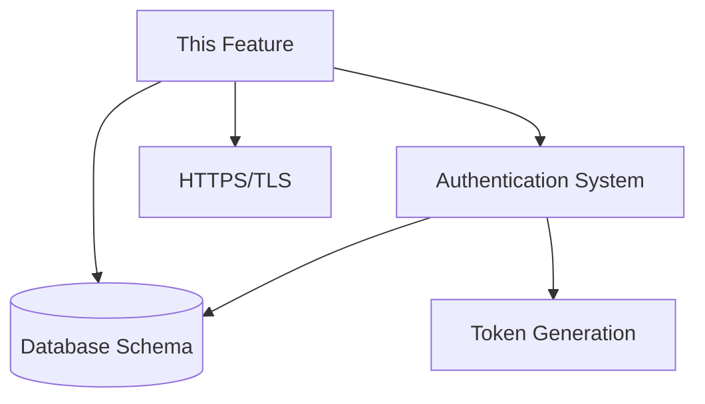

## User Input

```text
$ARGUMENTS
```

You **MUST** consider the user input before proceeding (if not empty).

## Outline

This command creates a comprehensive feature specification through an interactive process that validates against project standards and resolves ambiguities before implementation.

### Step 1: Create Specification File

Extract feature name from user input and create the spec file:

```bash
bash .cursor/scripts/create-spec.sh "$ARGUMENTS"
```

The script will:
- Generate a safe filename from the feature description
- Create feature directory: `docs/specs/[feature-name]/`
- Create `docs/specs/[feature-name]/spec.md` from template at `.cursor/templates/spec-template-example.md`
- Output the file path for the AI to work with

**IMPORTANT**: The created file contains placeholder sections. Use `.cursor/templates/spec-template-example.md` as your reference for:
- Expected specificity and detail level
- How to write concrete user stories
- Example data models
- Quality of problem statements
- What makes success criteria measurable

### Step 2: Generate Initial Specification

Based on the user's feature description (`$ARGUMENTS`), fill out the specification template with concrete details.

**Guidelines for AI Generation:**

1. **Make Informed Guesses**: Use context, industry standards, and common patterns to fill gaps
2. **Be Specific**: Use real examples, not abstract descriptions
   - ✅ "Sarah, a property manager overseeing 47 rental units"
   - ❌ "A property manager"
3. **Document Assumptions**: Record reasonable defaults in context
4. **High-Quality Clarifications**: Only ask questions that meet ALL three criteria:
   - (a) High impact - significantly affects architecture, security, cost, or UX
   - (b) Genuine ambiguity - multiple reasonable interpretations with different implications
   - (c) No safe default - cannot make reasonable assumption from context
5. **Prioritize by Impact**: 
   - Critical: Scope boundaries, Security/Privacy, Cost implications
   - Important: User Experience, Data model ambiguities
   - Low priority: Technical preferences with standard answers

**Specification Sections to Complete:**

#### Problem Statement
- **Who**: Specific user persona with real example (name, role, context)
- **What**: Exact problem they face (be concrete)
- **Why**: Why current solutions don't work (specific pain points)

#### User Stories (Priority Order)
- **P1 (MVP)**: Minimum viable functionality
  - As a [specific user], I want [specific action] so that [specific benefit]
  - Acceptance Criteria: [Measurable, testable criteria]
- **P2**: Next priority features
- **P3**: Nice-to-have features

#### Success Criteria (Technology-Agnostic)
- Must be measurable (time, percentage, count, rate)
- Must be user-focused (outcomes, not system internals)
- Must be verifiable without knowing implementation
- Examples:
  - ✅ "Users complete checkout in under 3 minutes"
  - ✅ "95% of searches return results in under 1 second"
  - ❌ "API response time under 200ms" (too technical)
  - ❌ "React components render efficiently" (framework-specific)

#### Functional Requirements
- Each requirement must be testable
- Use MUST/SHOULD/MAY language
- Include acceptance criteria

#### Data Model
- Entities with fields and types
- Relationships between entities
- Validation rules and constraints

#### Constraints
- Performance targets (specific numbers)
- Security requirements (specific measures)
- Cost limits (if applicable)

#### Out of Scope
- Explicitly excluded features
- Future iterations

### Step 3: Generate Diagrams

**CRITICAL**: Diagrams are the primary way users validate the plan. Create comprehensive diagrams for all relevant aspects of the specification.

After completing the initial specification, generate the following diagrams and add them to the spec file:

#### 1. User Journey Flowcharts (One per User Story)

For each user story (P1, P2, P3), create a flowchart showing the complete user journey from start to finish. These illustrate the flow of steps and state changes.

**Format**: Mermaid flowchart (preferred) or ASCII diagram for simple flows

**Include**:
- Entry points (where user starts)
- Decision points (user choices, validation checks)
- State transitions (what changes in the system)
- Error paths (what happens when things go wrong)
- Success outcomes (what the user achieves)

**Example structure**:


#### 2. Data Model Relation Diagram

Create a diagram showing all entities in the data model and their relationships.

**Format**: Mermaid ER diagram (preferred)

**Include**:
- All entities from the Data Model section
- Relationships between entities (one-to-one, one-to-many, many-to-many)
- Key fields that establish relationships
- Cardinality indicators

**Example structure**:


#### 3. Third-Party Dependencies Diagram

If the spec includes third-party dependencies, create a diagram showing how they relate to the project and each other.

**Format**: Mermaid flowchart or graph

**Include**:
- Project components that use each dependency
- Relationships between dependencies (if any)
- Data flow to/from dependencies
- Authentication/authorization flows if applicable

**Example structure**:


#### 4. Dependencies Diagram

Create a diagram showing project dependencies (internal dependencies, prerequisites, etc.) and how they relate.

**Format**: Mermaid flowchart or graph

**Include**:
- Feature dependencies (what must exist before this feature)
- Infrastructure dependencies (HTTPS, database, etc.)
- Service dependencies (if feature depends on other services)
- Dependency relationships (what depends on what)

**Example structure**:


#### 5. Additional Flow Diagrams

Create diagrams for any other flows, state transitions, or multi-concept relationships:

- **State transition diagrams**: For entities with state machines (e.g., user status: active → locked → inactive)
- **Process flow diagrams**: For multi-step processes (e.g., password reset flow)
- **Concept relationship diagrams**: For complex relationships between concepts (e.g., user roles and permissions)

**Guidelines for Diagram Creation**:

1. **Use Mermaid syntax** for all diagrams (preferred standard)
2. **Use ASCII diagrams** only for very simple cases (2-3 nodes)
3. **Make diagrams comprehensive**: Include all relevant paths, not just happy paths
4. **Label clearly**: Use descriptive node names and relationship labels
5. **Show error paths**: Include what happens when things fail
6. **Keep diagrams readable**: If a diagram becomes too complex, split into multiple diagrams

**Where to place diagrams in spec**:
- User Journey Flowcharts: After each user story section
- Data Model Relation Diagram: In the Data Model section
- Third-Party Dependencies Diagram: In the Third-Party Dependencies section
- Dependencies Diagram: In the Assumptions & Dependencies section
- Additional diagrams: In relevant sections or a new "Diagrams" section

**After generating diagrams**:
- Verify all diagrams render correctly in Mermaid
- Ensure diagrams match the written specification
- Update specification text if diagrams reveal inconsistencies

### Step 4: Validate Against agents.md

Load `.cursor/agents.md` and validate the spec:

**Validation Checklist:**

```markdown
## Content Quality
- [ ] No implementation details (languages, frameworks, APIs)
- [ ] Focused on user value and business needs
- [ ] Written for non-technical stakeholders
- [ ] All mandatory sections completed

## Alignment with Project Standards
- [ ] No violations of Code Standards from agents.md
- [ ] Aligns with Architecture Principles from agents.md
- [ ] Success criteria are measurable (no vague adjectives)
- [ ] All requirements testable and unambiguous

## Requirement Completeness
- [ ] Requirements have clear acceptance criteria
- [ ] User scenarios cover primary flows
- [ ] Edge cases identified
- [ ] Scope clearly bounded
- [ ] Dependencies and assumptions documented

## Specification Quality
- [ ] No placeholder markers like TODO, TBD, ???
- [ ] No vague adjectives ("fast", "scalable", "intuitive") without metrics
- [ ] Terminology consistent throughout
- [ ] No contradictory requirements
```

If any validation fails:
1. List the failing items with specific issues
2. Update the spec to address each issue
3. Re-validate (max 3 iterations)
4. If still failing, document issues and warn user

### Step 5: Interactive Clarification (Max 5 Questions)

**ONLY if critical ambiguities remain** after initial generation.

Scan for ambiguities in these categories (prioritized):

1. **Functional Scope & Behavior** (HIGHEST PRIORITY)
   - Core user goals unclear
   - Out-of-scope not explicit
   - User role differentiation missing

2. **Security & Privacy** (HIGH PRIORITY)
   - Authentication/authorization undefined
   - Data protection unclear
   - Compliance requirements missing

3. **User Experience & Interaction**
   - Critical user journeys unclear
   - Error/edge case handling undefined
   - Accessibility requirements missing

4. **Data Model & Scale**
   - Entity relationships ambiguous
   - Data volume assumptions missing
   - Lifecycle/state transitions unclear

5. **Non-Functional Quality Attributes**
   - Performance targets missing
   - Scalability limits undefined
   - Observability requirements unclear

**Clarification Strategy:**

**No hard limit on questions** - ask as many as needed, BUT each question must meet a high bar.

**Ask ONLY if ALL three conditions met:**
1. **High Impact**: Answer significantly affects architecture, security, cost, or UX
2. **Genuine Ambiguity**: Multiple reasonable interpretations with different implications
3. **No Safe Default**: Cannot make a reasonable assumption from context

**Question Format:**
- **Present ONE question at a time** (sequential, not all at once)
- Each question must be answerable with:
  - Multiple choice (2-5 options), OR
  - Short phrase answer (≤5 words)
- Stop when: (a) user signals "done", (b) no critical ambiguities remain

**This means:**
- Clear spec → 0 questions
- Ambiguous on critical issues → Ask every necessary question (could be 15+)
- Each question must be genuinely important

**Question Format:**

For each question:

1. **Analyze all options** and determine the best practice
2. **Present recommendation prominently** at the top:

```markdown
**Recommended:** Option B - Reasoning why this is best (1-2 sentences)

| Option | Description |
|--------|-------------|
| A | First option |
| B | Second option (recommended) |
| C | Third option |

Reply with option letter (A/B/C), "yes" to accept recommendation, or provide custom answer (≤5 words).
```

3. **After user answers:**
   - If "yes", "recommended", or "suggested" → Use your recommendation
   - Otherwise validate answer maps to option or fits ≤5 word constraint
   - If ambiguous, ask for quick clarification (doesn't count as new question)
   - Record answer and immediately update spec

4. **Integration after each answer:**
   - Add to `## Clarifications` section: `- Q: [question] → A: [answer]`
   - Update appropriate spec section (Functional Requirements, Data Model, etc.)
   - Remove any conflicting earlier statements
   - Save spec file after each update

**Example Clarification:**

```markdown
Question 1: User Authentication

**Recommended:** Option B (Email/Password) - Balances security with ease of implementation. OAuth can be added later as P2 feature.

| Option | Description |
|--------|-------------|
| A | Email/Password only | Simple, full control, requires password reset flow |
| B | Email/Password + OAuth | Flexible, better UX, slightly more complex |
| C | OAuth only | Easiest for users, dependency on third-party |

Reply with A/B/C, "yes" for recommendation, or provide alternative (≤5 words).
```

### Step 6: Final Validation

After clarification (or if none needed), perform final validation:

**Final Checklist:**

```markdown
- [ ] Zero [NEEDS CLARIFICATION] markers remain
- [ ] All user stories have acceptance criteria
- [ ] Success criteria measurable and technology-agnostic
- [ ] Edge cases identified
- [ ] No vague terminology without metrics
- [ ] Consistent terminology throughout
- [ ] No violations of agents.md standards
```

If any items fail, report them clearly and suggest next steps.

### Step 7: Report Completion

Display summary:

```markdown
✅ Feature specification created!

📝 File: docs/specs/[feature-name]/spec.md

📊 Summary:
- User Stories: [count] (P1: [count], P2: [count], P3: [count])
- Functional Requirements: [count]
- Success Criteria: [count]
- Clarifications Resolved: [count]

✅ Validation Status:
- Aligned with agents.md: ✓
- All requirements testable: ✓
- Success criteria measurable: ✓
- Scope clearly bounded: ✓

🎯 Next Steps:

**Recommended**: Update agent-docs with recent best practices before designing:
```bash
/update-agent-docs docs/specs/[feature-name]/spec.md
```

This will:
- Search for recent best practices (last 3 months) matching your stack
- Focus on domains relevant to this spec (API, database, etc.)
- Present findings for your approval
- Ensure design decisions use current patterns

**When to skip**: If you updated agent-docs recently (< 1 month) or working on a quick feature.

**Or proceed directly to design:**
```bash
/design-system docs/specs/[feature-name]/spec.md
```
1. Review the spec for accuracy
2. Create system design with /design-system docs/specs/[feature-name]/spec.md
3. Or refine spec further if needed

💡 Tip: This spec is living documentation. Update it as requirements evolve.
```

## Guidelines

### For AI Generation

**Make informed guesses using:**
- Industry standard practices for the domain
- Common patterns in similar implementations
- Risk reduction (security, performance, maintainability)
- Alignment with project goals visible in spec

**Document assumptions like:**
- "Assuming standard web app performance (<200ms API response)"
- "Assuming OAuth2 for third-party auth"
- "Assuming RESTful API design patterns"

**Only use [NEEDS CLARIFICATION] for:**
- Feature scope boundaries (include/exclude specific use cases)
- Security/compliance where legally/financially significant
- User permission models if multiple conflicting interpretations
- Performance targets when highly variable by use case

**Examples of reasonable defaults** (don't ask about these):
- Data retention: Industry-standard practices
- Performance targets: Standard web/mobile app expectations
- Error handling: User-friendly messages with fallbacks
- Authentication method: Session-based or OAuth2 for web apps
- Integration patterns: RESTful APIs unless specified

### Writing Quality Success Criteria

**Good Examples (Measurable, User-Focused):**
- "Users can complete account setup in under 2 minutes"
- "System supports 10,000 concurrent users without degradation"
- "95% of page loads complete in under 1 second"
- "Task completion rate improves by 40% vs. manual process"
- "Support ticket volume reduces by 30% through self-service"

**Bad Examples (Too Technical):**
- "API response time under 200ms" → Use "Users see results instantly (<1s)"
- "Database query optimization" → Use "Search results load in <500ms"
- "Redis cache hit rate 80%" → Use user-facing metric
- "React components render efficiently" → Describe user experience

### Specification Quality Principles

1. **Specificity Over Generality**: Real examples, real numbers, real scenarios
2. **User Value Over Technical Features**: What users accomplish, not what system does
3. **Testability**: Every requirement can be verified
4. **Completeness**: All questions answered (or explicitly deferred)
5. **Consistency**: Same terms, same patterns throughout

## Context

User's feature description: $ARGUMENTS