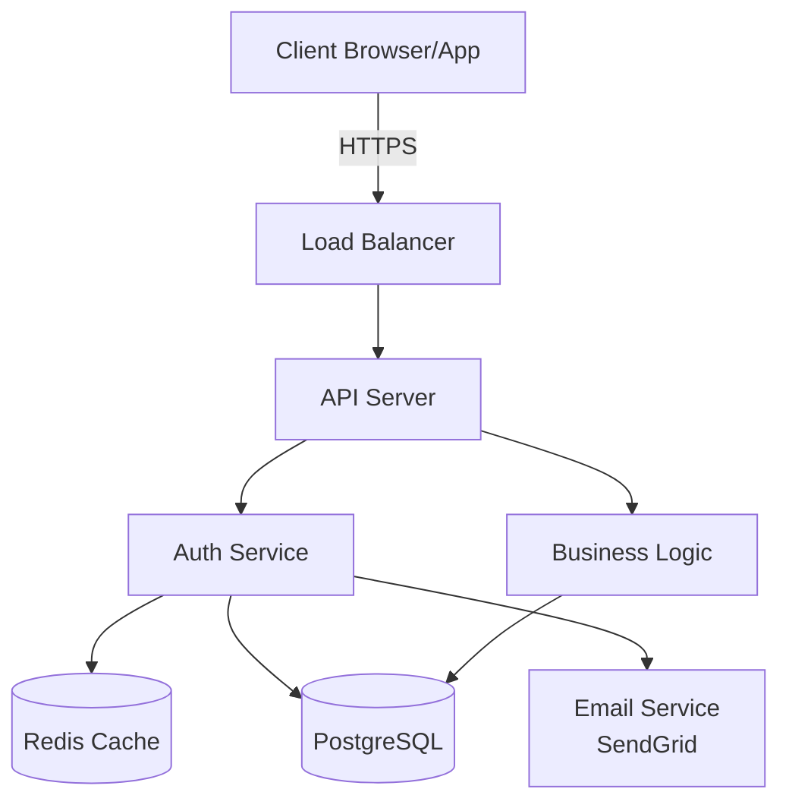
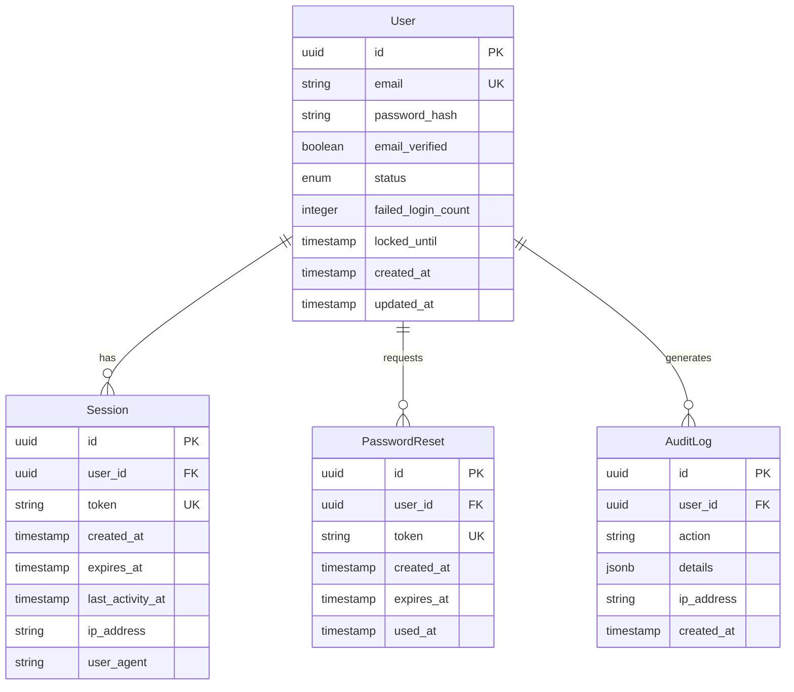
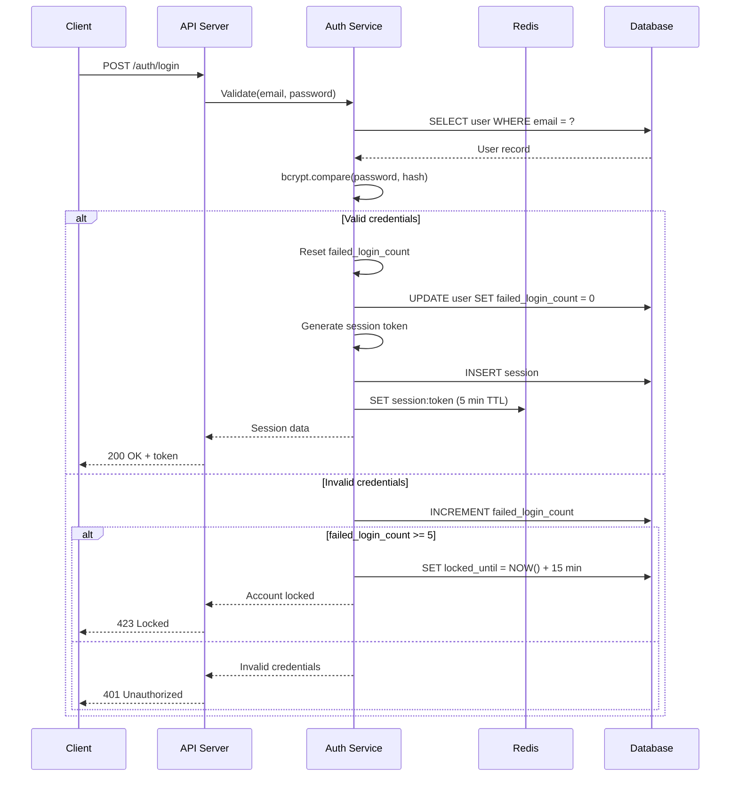
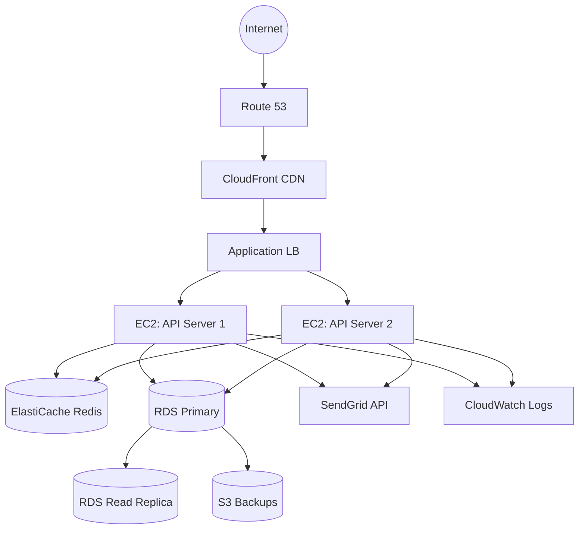

# DESIGN TEMPLATE - Example: User Authentication System

This is a reference template showing what a high-quality system design looks like. Use this as a guide when creating your own designs.

---

# System Design: User Authentication with Email/Password

**Created**: 2026-01-11  
**Status**: Approved  
**Related Spec**: user-authentication.md  
**Related Research**: user-authentication-research.md

---

## 1. Architecture Overview

### High-Level Architecture



### Component Responsibilities

#### API Layer
- Request validation and sanitization
- Authentication token verification
- Rate limiting enforcement
- Response formatting and compression
- CORS policy enforcement

#### Auth Service
- Password hashing (bcrypt cost 10)
- Session/token generation
- Login attempt tracking
- Account lockout logic
- Password reset flow

#### Business Logic Layer
- User registration workflow
- Email verification
- Profile management
- Audit logging

#### Data Layer
- User CRUD operations
- Session management
- Query optimization
- Connection pooling

### Technology Stack

| Component | Technology | Rationale |
|-----------|------------|-----------|
| Backend | Node.js + Express | Team expertise, agents.md principle "Use team-familiar tech" |
| Database | PostgreSQL 15 | ACID compliance for auth data, JSON support for metadata |
| Cache | Redis 7 | Session storage, rate limiting counters |
| Auth | bcrypt + JWT | Industry standard, bcrypt for passwords, JWT for stateless sessions |
| API | REST | Simple CRUD operations, no complex graph queries needed |
| Email | SendGrid | Free tier (100/day), good deliverability |

---

## 2. Database Schema

### Entity Relationship Diagram



### Table Definitions

#### Table: users

**Purpose**: Store user accounts and authentication data

```sql
CREATE TABLE users (
    id UUID PRIMARY KEY DEFAULT gen_random_uuid(),
    email VARCHAR(255) UNIQUE NOT NULL,
    password_hash VARCHAR(60) NOT NULL,  -- bcrypt always 60 chars
    email_verified BOOLEAN DEFAULT FALSE,
    status VARCHAR(20) DEFAULT 'active' 
        CHECK (status IN ('active', 'inactive', 'locked')),
    failed_login_count INTEGER DEFAULT 0,
    locked_until TIMESTAMP,
    created_at TIMESTAMP DEFAULT CURRENT_TIMESTAMP,
    updated_at TIMESTAMP DEFAULT CURRENT_TIMESTAMP,
    
    CONSTRAINT email_format 
        CHECK (email ~* '^[A-Za-z0-9._%+-]+@[A-Za-z0-9.-]+\.[A-Z|a-z]{2,}$')
);

-- Indexes
CREATE UNIQUE INDEX idx_users_email_lower ON users(LOWER(email));
CREATE INDEX idx_users_status ON users(status) WHERE status = 'active';
CREATE INDEX idx_users_locked_until ON users(locked_until) 
    WHERE locked_until IS NOT NULL;

-- Trigger for updated_at
CREATE TRIGGER update_users_updated_at 
    BEFORE UPDATE ON users
    FOR EACH ROW
    EXECUTE FUNCTION update_updated_at_column();
```

**Indexes**:
- Primary: `id` (clustered)
- Unique: `LOWER(email)` - Case-insensitive email lookup
- Secondary: `status` - Filtered index for active users only
- Secondary: `locked_until` - For cleanup of expired locks

**Growth Estimates**:
- Initial: 100 users
- 1 year: 10,000 users
- Storage: ~1MB per 1,000 users (1KB per user)

#### Table: sessions

**Purpose**: Track active user sessions

```sql
CREATE TABLE sessions (
    id UUID PRIMARY KEY DEFAULT gen_random_uuid(),
    user_id UUID NOT NULL REFERENCES users(id) ON DELETE CASCADE,
    token VARCHAR(64) UNIQUE NOT NULL,
    created_at TIMESTAMP DEFAULT CURRENT_TIMESTAMP,
    expires_at TIMESTAMP NOT NULL,
    last_activity_at TIMESTAMP DEFAULT CURRENT_TIMESTAMP,
    ip_address VARCHAR(45),  -- IPv6 max length
    user_agent TEXT
);

-- Indexes
CREATE UNIQUE INDEX idx_sessions_token ON sessions(token);
CREATE INDEX idx_sessions_user_id ON sessions(user_id);
CREATE INDEX idx_sessions_expires_at ON sessions(expires_at) 
    WHERE expires_at > CURRENT_TIMESTAMP;

-- Cleanup expired sessions (run daily)
CREATE INDEX idx_sessions_expired ON sessions(expires_at) 
    WHERE expires_at <= CURRENT_TIMESTAMP;
```

**Session Cleanup**:
```sql
-- Cron job runs daily
DELETE FROM sessions WHERE expires_at <= CURRENT_TIMESTAMP;
```

### Migration Strategy

**Approach**: Sequential numbered migrations with up/down

**Example Migration** (001_create_users.sql):
```sql
-- Up
CREATE TABLE users (...);
CREATE INDEX ...;

-- Down  
DROP TABLE users CASCADE;
```

**Testing**: Copy production schema to staging, run migrations, verify data integrity

---

## 3. API Contracts

### REST API Design

**Base URL**: `https://api.example.com/v1`

**Authentication**: Bearer token in Authorization header or secure cookie

**Content Type**: `application/json`

**Versioning**: URL-based (`/v1`, `/v2`)

### Endpoint: POST /auth/register

**Purpose**: Create new user account

**Authentication**: Not required

**Request**:
```json
{
  "email": "sarah@example.com",
  "password": "SecurePass123"
}
```

**Request Validation**:
- `email`: string, required, valid email format, max 255 chars
- `password`: string, required, min 8 chars, must contain letter and number

**Response (201 Created)**:
```json
{
  "user": {
    "id": "550e8400-e29b-41d4-a716-446655440000",
    "email": "sarah@example.com",
    "email_verified": false,
    "created_at": "2026-01-11T10:30:00Z"
  },
  "session": {
    "token": "a1b2c3d4e5f6...",
    "expires_at": "2026-01-12T10:30:00Z"
  }
}
```

**Error Responses**:

**400 Bad Request** - Invalid input:
```json
{
  "error": "VALIDATION_ERROR",
  "message": "Invalid input data",
  "fields": {
    "email": "Email address is not valid",
    "password": "Password must be at least 8 characters"
  },
  "request_id": "req_abc123"
}
```

**409 Conflict** - Email already exists:
```json
{
  "error": "EMAIL_EXISTS",
  "message": "An account with this email already exists",
  "action": "login_or_reset",
  "request_id": "req_abc124"
}
```

**Rate Limiting**: 3 registrations per IP per hour

---

### Endpoint: POST /auth/login

**Purpose**: Authenticate user and create session

**Authentication**: Not required

**Request**:
```json
{
  "email": "sarah@example.com",
  "password": "SecurePass123"
}
```

**Response (200 OK)**:
```json
{
  "user": {
    "id": "550e8400-e29b-41d4-a716-446655440000",
    "email": "sarah@example.com",
    "email_verified": true
  },
  "session": {
    "token": "a1b2c3d4e5f6...",
    "expires_at": "2026-01-12T10:30:00Z"
  }
}
```

**Error Responses**:

**401 Unauthorized** - Invalid credentials:
```json
{
  "error": "INVALID_CREDENTIALS",
  "message": "Email or password is incorrect",
  "request_id": "req_abc125"
}
```

**423 Locked** - Account locked:
```json
{
  "error": "ACCOUNT_LOCKED",
  "message": "Account temporarily locked. Try again in 15 minutes.",
  "locked_until": "2026-01-11T10:45:00Z",
  "request_id": "req_abc126"
}
```

**Rate Limiting**: 5 attempts per IP per minute

---

## 4. Authentication & Authorization

### Authentication Flow



### Session Management

**Token Format**: 
- Cryptographically random 64-char hex string
- Generated using: `crypto.randomBytes(32).toString('hex')`
- Entropy: 256 bits (2^256 possibilities)

**Storage**:
- Database: Persistent storage
- Redis: 5-minute cache for fast validation
- Client: Secure HTTP-only cookie

**Lifetime**: 
- Default: 24 hours of inactivity
- "Remember me": 7 days
- Sliding window: Updated on each request

**Validation on Every Request**:
```javascript
async function validateSession(token) {
    // Check cache first (fast)
    let session = await redis.get(`session:${token}`);
    if (session) return JSON.parse(session);
    
    // Check database (slower)
    session = await db.query(
        'SELECT * FROM sessions WHERE token = $1 AND expires_at > NOW()',
        [token]
    );
    
    if (!session) return null;
    
    // Update activity timestamp
    await db.query(
        'UPDATE sessions SET last_activity_at = NOW() WHERE id = $1',
        [session.id]
    );
    
    // Cache for 5 minutes
    await redis.setex(`session:${token}`, 300, JSON.stringify(session));
    
    return session;
}
```

### Authorization Rules

**Public Endpoints** (no authentication):
- `POST /auth/register`
- `POST /auth/login`
- `POST /auth/forgot-password`
- `POST /auth/reset-password`

**Authenticated Endpoints** (valid session required):
- `GET /auth/me`
- `POST /auth/logout`
- `PATCH /users/me`
- All other endpoints

---

## 5. Error Handling Strategy

### Error Categories

| Status | Category | User Message | System Action |
|--------|----------|--------------|---------------|
| 400 | Validation | Specific field errors | Log WARN with field details |
| 401 | Auth Missing | "Please log in" | Log INFO, no details |
| 403 | Permission | "Access denied" | Log WARN with attempted action |
| 404 | Not Found | "Not found" | Log INFO |
| 409 | Conflict | Specific conflict | Log WARN |
| 422 | Business Logic | Specific error | Log WARN with context |
| 429 | Rate Limit | "Too many requests" | Log WARN with IP |
| 500 | Server | "Something went wrong" | Log ERROR with stack trace |
| 503 | Dependency | "Temporarily unavailable" | Log ERROR, alert ops |

### Error Response Format

**All errors follow this format**:
```json
{
  "error": "ERROR_CODE",
  "message": "Human-readable message",
  "fields": {},  // Only for validation errors
  "request_id": "req_unique_id",
  "timestamp": "2026-01-11T10:30:00Z"
}
```

### Logging Strategy

**Structured Logging** (JSON format):
```json
{
  "level": "ERROR",
  "timestamp": "2026-01-11T10:30:00.123Z",
  "request_id": "req_abc123",
  "user_id": "user_550e8400",
  "method": "POST",
  "path": "/auth/login",
  "status": 500,
  "duration_ms": 245,
  "error": {
    "message": "Database connection failed",
    "stack": "..."
  },
  "context": {
    "ip": "192.168.1.1",
    "user_agent": "..."
  }
}
```

**Log Levels**:
- `ERROR`: 500/503 errors, database failures, external service failures
- `WARN`: 429 rate limits, 401 auth failures, 409 conflicts
- `INFO`: Successful operations, 200/201 responses
- `DEBUG`: Request/response details (dev only)

**Never Log**:
- Plain text passwords
- Password hashes
- Session tokens
- Full request bodies (may contain passwords)
- Full credit card numbers

---

## 6. Security Considerations

### Threat Model

| Threat | Attack Vector | Mitigation | Priority |
|--------|---------------|------------|----------|
| Credential Stuffing | Automated login attempts with leaked credentials | Rate limiting, account lockout, email alerts | HIGH |
| SQL Injection | Malicious SQL in input fields | Parameterized queries only, input validation | CRITICAL |
| XSS | Malicious scripts in user input | Input sanitization, CSP headers | HIGH |
| CSRF | Unauthorized requests from malicious sites | SameSite cookies, CSRF tokens | MEDIUM |
| Session Hijacking | Stolen session tokens | HTTPS only, HttpOnly cookies, short expiration | HIGH |
| Brute Force | Password guessing | Rate limiting, account lockout, strong password requirements | HIGH |
| Data Breach | Database compromise | Encrypted passwords (bcrypt), encrypted PII at rest | CRITICAL |

### Security Measures

**Password Security**:
```javascript
// Hashing on registration
const hash = await bcrypt.hash(password, 10); // Cost factor 10 = ~250ms

// Verification on login
const valid = await bcrypt.compare(password, hash);

// IMPORTANT: Always compute hash even on invalid email
// to prevent timing attacks
if (!user) {
    await bcrypt.hash(password, 10); // Dummy hash
    throw new Error('Invalid credentials');
}
```

**Requirements**:
- Minimum 8 characters
- At least one letter
- At least one number
- Check against top 10,000 common passwords

**Session Security**:
```javascript
// Cookie configuration
res.cookie('session_token', token, {
    httpOnly: true,      // Prevent JavaScript access
    secure: true,        // HTTPS only
    sameSite: 'strict',  // CSRF protection
    maxAge: 86400000     // 24 hours
});
```

**API Security**:
```javascript
// CORS configuration
app.use(cors({
    origin: process.env.ALLOWED_ORIGINS.split(','),
    credentials: true
}));

// Rate limiting
const limiter = rateLimit({
    windowMs: 60 * 1000,     // 1 minute
    max: 5,                   // 5 requests
    message: { error: 'RATE_LIMIT_EXCEEDED' }
});
app.use('/auth/login', limiter);
```

**Input Validation**:
```javascript
// Email validation
const emailRegex = /^[A-Za-z0-9._%+-]+@[A-Za-z0-9.-]+\.[A-Z|a-z]{2,}$/;
if (!emailRegex.test(email)) {
    throw new ValidationError('Invalid email format');
}

// SQL injection prevention
const user = await db.query(
    'SELECT * FROM users WHERE email = $1',  // Parameterized
    [email]  // Never string concatenation
);
```

### Compliance

**GDPR Requirements**:
- User consent for data processing
- Right to access data (`GET /users/me/data`)
- Right to deletion (`DELETE /users/me`)
- Data portability (export to JSON)
- Breach notification (within 72 hours)

**Data Retention**:
- Active accounts: Indefinite
- Deleted accounts: 30-day soft delete
- Session logs: 90 days
- Audit logs: 1 year

---

## 7. Performance Strategy

### Performance Targets

From spec:
- API responses < 500ms for 95% of requests
- Database queries < 100ms for 95% of queries
- Password hash computation: 250-350ms
- Support 1,000 concurrent sessions
- Handle 100 login requests/minute

### Optimization Approaches

**Database Optimizations**:
```sql
-- Partial indexes for active users only
CREATE INDEX idx_users_active 
    ON users(email) 
    WHERE status = 'active';

-- Covering index for session validation
CREATE INDEX idx_sessions_token_covering 
    ON sessions(token, user_id, expires_at)
    WHERE expires_at > CURRENT_TIMESTAMP;

-- Connection pooling
const pool = new Pool({
    max: 20,              // Maximum connections
    min: 5,               // Minimum connections
    idleTimeoutMillis: 30000
});
```

**Caching Strategy**:

| Data | Cache | TTL | Invalidation |
|------|-------|-----|--------------|
| Session validation | Redis | 5 min | On logout |
| User profile | Redis | 10 min | On update |
| Rate limit counters | Redis | 1 min | Sliding window |
| Failed login count | Redis | 15 min | On successful login |

**Query Optimization**:
```javascript
// BAD: N+1 query problem
for (const session of sessions) {
    const user = await db.query('SELECT * FROM users WHERE id = $1', [session.user_id]);
}

// GOOD: Single query with JOIN
const sessions = await db.query(`
    SELECT s.*, u.email, u.status
    FROM sessions s
    JOIN users u ON u.id = s.user_id
    WHERE s.expires_at > NOW()
`);
```

### Monitoring & Metrics

**Application Metrics**:
```javascript
// Prometheus metrics
const loginDuration = new Histogram({
    name: 'login_duration_seconds',
    help: 'Login request duration',
    buckets: [0.1, 0.5, 1.0, 2.0, 5.0]
});

const activeUsers = new Gauge({
    name: 'active_users_total',
    help: 'Number of users with active sessions'
});
```

**Dashboards**:
- Request rate (by endpoint)
- Latency (p50, p95, p99)
- Error rate (by status code)
- Database query time
- Cache hit rate
- Active sessions count

**Alerting**:
- Error rate > 1% for 5 minutes → Page on-call
- p95 latency > 1s for 5 minutes → Alert ops
- Database connections > 18/20 → Alert ops
- Cache hit rate < 70% → Investigate

---

## 8. Deployment Architecture

### Environments

| Environment | Purpose | Database | External Services | Logging |
|-------------|---------|----------|-------------------|---------|
| Development | Local dev | Docker PostgreSQL | Mocked (console) | Console |
| Staging | Pre-prod testing | RDS PostgreSQL | SendGrid test | CloudWatch |
| Production | Live system | RDS PostgreSQL | SendGrid prod | CloudWatch + Datadog |

### Infrastructure Diagram



### Deployment Strategy

**Approach**: Rolling deployment with health checks

**Steps**:
```bash
# 1. Database migrations (automated)
./scripts/migrate.sh production

# 2. Deploy to staging
./scripts/deploy.sh staging
./scripts/smoke-test.sh staging

# 3. Deploy to production (rolling)
./scripts/deploy.sh production --rolling

# 4. Monitor
./scripts/monitor.sh --duration=15m --error-threshold=1%

# 5. Auto-rollback if errors
if error_rate > 1%; then
    ./scripts/rollback.sh production
fi
```

**Health Checks**:
```javascript
// /health endpoint
app.get('/health', async (req, res) => {
    const checks = {
        database: await checkDatabase(),
        redis: await checkRedis(),
        external: await checkSendGrid()
    };
    
    const healthy = Object.values(checks).every(c => c.healthy);
    res.status(healthy ? 200 : 503).json(checks);
});
```

### Scaling Strategy

**Current Capacity**:
- 2 API servers (t3.medium)
- Each handles ~50 req/sec
- Total: 100 req/sec

**Scaling Triggers**:
- **Scale Up**: CPU > 70% for 5 minutes
- **Scale Down**: CPU < 30% for 10 minutes

**Auto-Scaling Configuration**:
```yaml
min_instances: 2
max_instances: 10
target_cpu: 60%
cooldown_period: 300s
```

**Database Scaling**:
- **Read Replicas**: Add when read traffic > 1000/sec
- **Vertical Scaling**: Upgrade RDS instance class at 80% CPU
- **Connection Pooling**: Prevent connection exhaustion

---

## 9. Testing Strategy

### Test Pyramid

```
       ┌─────────┐
       │   E2E   │   ~10% - Critical user flows only
       ├─────────┤
       │  API    │   ~20% - All endpoints
       ├─────────┤
       │  Unit   │   ~70% - All business logic
       └─────────┘
```

### Unit Tests

**Coverage Target**: 85%+

**What to Test**:
- Password hashing/verification
- Email validation
- Session token generation
- Rate limiting logic
- Error handling

**Example**:
```javascript
describe('Auth Service', () => {
    it('should hash passwords with bcrypt', async () => {
        const password = 'SecurePass123';
        const hash = await hashPassword(password);
        
        expect(hash).toMatch(/^\$2[aby]\$/);
        expect(hash.length).toBe(60);
        expect(await verifyPassword(password, hash)).toBe(true);
    });
    
    it('should reject weak passwords', () => {
        expect(() => validatePassword('123')).toThrow('Password too short');
        expect(() => validatePassword('password')).toThrow('Must contain number');
    });
});
```

### Integration Tests

**What to Test**:
- All API endpoints
- Database queries
- Redis caching
- Email sending (mocked)

**Example**:
```javascript
describe('POST /auth/register', () => {
    it('should create user and return session', async () => {
        const res = await request(app)
            .post('/auth/register')
            .send({
                email: 'test@example.com',
                password: 'SecurePass123'
            });
        
        expect(res.status).toBe(201);
        expect(res.body.user.email).toBe('test@example.com');
        expect(res.body.session.token).toBeTruthy();
        
        // Verify in database
        const user = await db.findUserByEmail('test@example.com');
        expect(user).toBeTruthy();
    });
});
```

### E2E Tests

**Critical Flows Only**:
1. Complete registration flow
2. Login → Access protected resource → Logout
3. Forgot password → Reset → Login

**Tools**: Playwright or Cypress

---

## 10. Open Questions & Decisions

### Design Decisions Log

| Decision | Options | Chosen | Rationale | Date |
|----------|---------|--------|-----------|------|
| Database | PostgreSQL, MySQL, MongoDB | PostgreSQL | ACID for auth, team experience, JSON support | 2026-01-11 |
| Session Storage | Database, Redis, JWT | Database + Redis cache | Revocable sessions, fast validation | 2026-01-11 |
| Password Hashing | bcrypt, argon2, scrypt | bcrypt cost 10 | Industry standard, 250ms sweet spot | 2026-01-11 |
| API Style | REST, GraphQL | REST | Simple CRUD, no complex queries needed | 2026-01-11 |

---

## 11. Future Considerations

### Not in MVP, Consider Later

- OAuth/Social login (Google, GitHub)
- Two-factor authentication (TOTP)
- Magic link login (passwordless)
- Session management UI (view/revoke sessions)
- IP-based anomaly detection
- CAPTCHA for registration

### Technical Debt Acknowledged

- Email verification is optional (should be required for password reset)
- No account activity monitoring (suspicious login detection)
- Rate limiting is per-IP (should also be per-user)
- Session cleanup is daily cron (should be background job)

---

**Last Updated**: 2026-01-11

**Review Status**: [X] Approved [ ] Changes Requested

**Reviewers**: 
- Technical Lead: Approved - 2026-01-11
- Security: Approved with note: "Add CAPTCHA if bot registrations observed" - 2026-01-11
